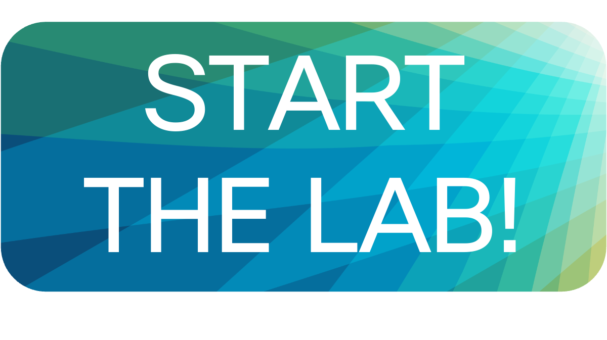

# LTRCRT-2005 Lab guide
## Automate with Accuracy! IOS XE Event-Driven Automation with YANG, Sources of Truth, and Webex Bots

### Your Instructors
- **Jeremy Cohoe**, Cisco Technical Marketing Engineer
- **Palmer Sample**, Cisco Developer Advocate
- **Juulia Santala**, Cisco Technical Solutions Architect

### Session abstract
> You have started learning network automation, however you still maintain your IP addresses with (outdated) spreadsheets, manually create network diagrams, and lack the big picture and visibility to what you are automating. Data accuracy is a growing problem in today's agile environments, so join us and take the elevator to the next level to embrace sources of truth!
> 
> In this lab, you will:
>
> - write a **Python based web application** to listen for webhook events from **a source of truth**
> - dive into **model-driven programmability** using **YANG** models to automate the deployment of the changes done in the source of truth
> - create a **Webex Bot** and start receiving **real-time updates** from the network changes to your Webex application
> 
> This lab gets you started with technologies such as NetBox, Cisco YANG Suite, NETCONF, and Cisco Webex REST APIs. The lab is designed for those who have already started scripting with Python, but want to take your skills to the next level and start automating with accuracy.

