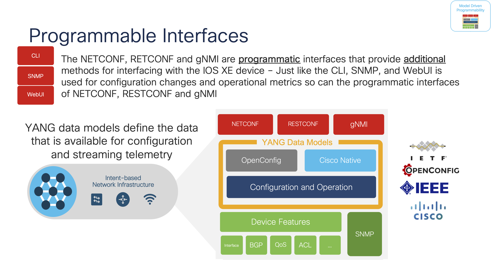
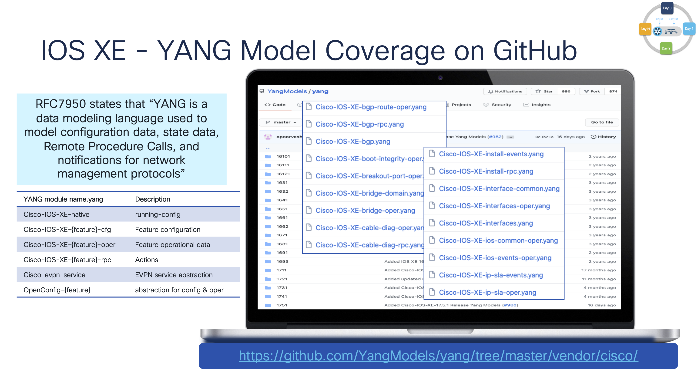

[Helper files cover page](./README.md) | [Lab guide cover page](../lab_guide/README.md)

# Short introduction to IOS XE programmability and YANG models

There are several legacy and programmable interfaces available to manage IOS XE with and they each have their own unique pro's and con's or advantages and disadvantages. **NETCONF/YANG** is based on RFC standards and has a long history of feature innovations. The YANG data models define what operations the API supports and also describes the features and how to configure them.

> **Note**: The **netconf-yang** API is already enabled on the lab switches. Check for this CLI in the `show run | include netconf` or run the `show netconf-yang` for operational details of the feature.

The YANG data models define what the API's support. There are many data models and they are sorted into a few different categories as described below. The **`Cisco-IOS-XE-native.yang`** has the majority of the **`running-config`** modelled within it and will be used to change the running configuration on the switch. There are some features which have **`CFG`** or configuration specific models, and of course for monitoring of operational data like from **`show commands`** there is a variety of **`oper`** models.

The YANG data models can be view and explored from the [public Github repository](https://github.com/YangModels/yang/blob/main/vendor/cisco/xe/17111/Cisco-IOS-XE-native.yang). However in this lab the YANG Suite tooling will be used to download and access the data models directly from the running C9300 in the lab and not from Github. 

