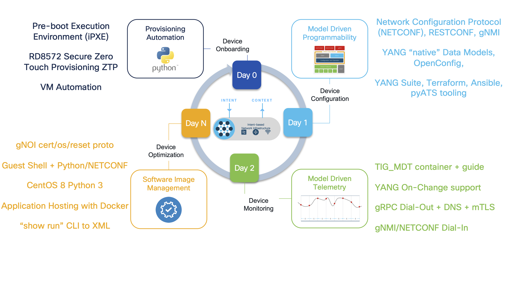
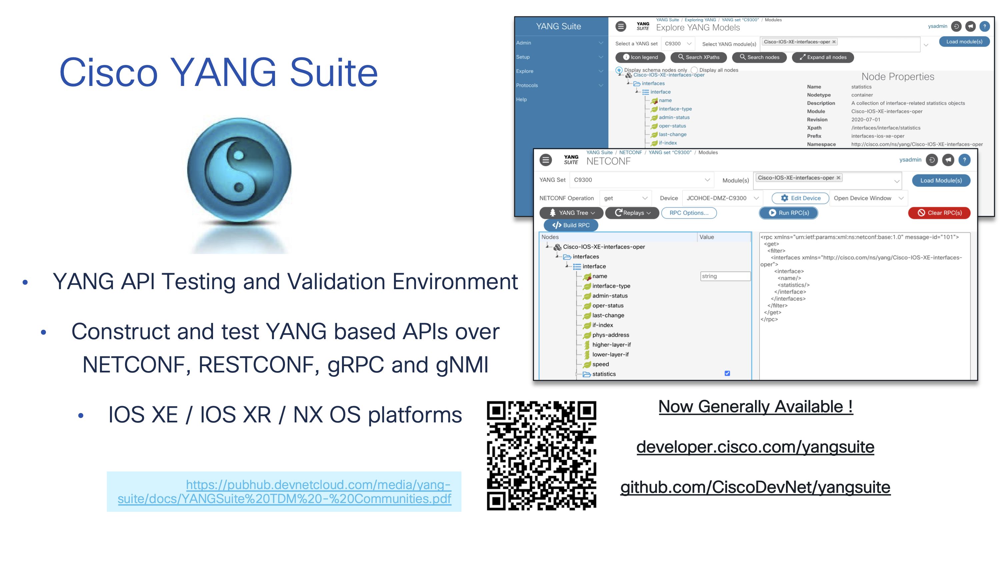
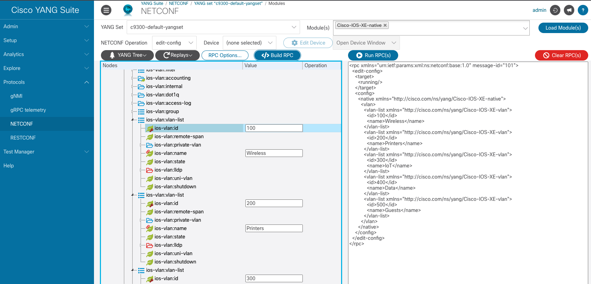
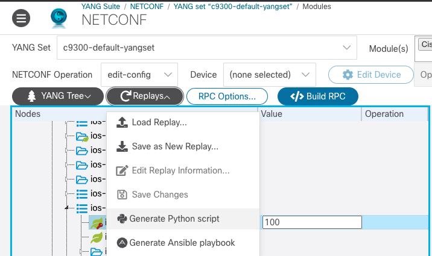
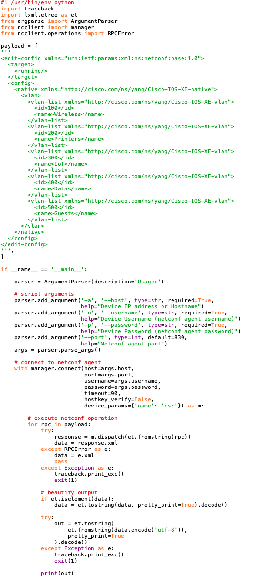

[Helper files](../help/README.md) | [Back to the cover page](./README.md)


# 1. Setup for your events: YANG models and NETCONF for configuration change

The first ticket that has come in is about a simple task - add new VLANs to a switch and assign names to them. You know how to do this manually, but it will take you some time to deploy and test the change to the whole network. You have been itching on deploying an event driven automation workflow, therefor you decide to create your **Minimum Viable Product** (MVP) of this for the VLAN changes.

The first task for you is to learn how to do the configuration change using programmability. This is a setup task for your events - you are basically setting up the back end automation that will be triggered by the incoming events.

> **In this task you will**
> - Learn how to use YANG Suite to figure out correct YANG models
> - Update VLAN configuration by running a NETCONF RPC from YANG Suite GUI
> - Generate a Python script from YANG Suite

| Task | Name | Status |
| - | - | - |
| 1. | **Setup for your events: YANG models and NETCONF for configuration change** | ⬅️ |
| 2. | [Add an event: Webex bot and Webex Webhook](2.md) | ⬜ |
| 3. | [Add an event: NetBox for source of truth](3.md) | ⬜ |
| 4. | [Add an event: Ticket system](4.md) | ⬜ |


**Task flow:**


## 1.1. Introduction to YANG Suite 

This task will guide you through the workflow of using YANG Suite as your documentation for the IOS XE YANG models. YANG Suite can be a great help when creating your automation scripts: It will both help you navigate the different models in graphical user interface, but also build a payload example for you to deploy in your Python scripts.

The API lifecycle for Cisco Catalyst and IOS XE is shown below and the focus of this lab is the Day 1 Model Driven Programmability "NETCONF/YANG" features. This NETCONF API will be used for the programmatic management and interactions with the Catalyst 9300 switch in the lab.



> **Note**: If you are new to IOS XE programmability and YANG models, check the helper file [Short introduction to IOS XE programmability and YANG models](../help/yang.md)

YANG Suite is the testing and validation tool developed and used by Cisco for the past 5 years and since 2021 has been freely available for customers at [DevNet page for YANG Suite](https://developer.cisco.com/yangsuite/) and [Github](https://github.com/CiscoDevNet/yangsuite/). There is extensive support for all API operations on IOS XE within this very powerful tool that will be used within this lab.



> **Note**: YANG Suite has many capabilities. Today the focus will be on the Day 1 NETCONF API, and the Core "NETCONF" plugin in YANG Suite will be used to work with the **VLAN** and **Interface** features.

### 1.1.1 Get started with YANG Suite

Now that you have gathered the basic understanding, you shall use YANG suite to configure the VLANs of your Pod's Catalyst 9k.

**STEPS:**

<table>

<tr><th>Step</th><th width=50%>Description</th><th>Screenshot / code snippet</th></tr>

<tr><td>1.</td><td>

Run the `netconf/get-yangsuite-details.sh` script in the Visual Studio Code terminal to retrieve your Pod's YANG Suite url and credentials. Copy the YANG Suite URL that is displayed to the clipboard.

</td><td>

```bash
sh netconf/get-yangsuite-details.sh
```

<details>
<summary><strong> 💡 Example output (click to view) </strong></summary>

```text
$ sh netconf/get-yangsuite-details.sh

YANG Suite Access Details:

YANG Suite URL:       https://yangsuite-url.example.com:1234
YANG Suite Username:  yangsuite_username
YANG Suite Password:  yangsuite_password

```
</details>

</td></tr>
<tr><td>2.</td><td>

Open a new tab in the browser and paste the YANG Suite URL. Use the credentials from step 1 to login.

</td><td>


</td></tr>
<tr><td>3.</td><td>

Start by checking the device reachability. Your Pod's switch is already setup in the YANG Suite devices, but before starting any tests against it, it is good to verify that you can reach it nicely.

From the left menu, click `Setup` > `Device profiles.` Select the device profile for your pod's device, and click `Check selected device's reachability`.

> **Note**: If your pod device is **not** reachable, ask help from instructor before continuing.

</td><td>


</td></tr>
</table>


### 1.1.2 Retrieve the current VLANs

In the next steps, you will use YANG Suite to run a NETCONF operation **`get-config`** to retrieve current VLAN configuration.

<table>

<tr><th>Step</th><th width=50%>Description</th><th>Screenshot / code snippet</th></tr>

<tr><td>1.</td><td colspan=2>

From the left menu, click `Protocols` > `NETCONF`.


</td></tr>

<tr><td>2.</td><td>

Start selecting options for your NETCONF RPC call.
1. Protocol: “NETCONF”
2. YANG Set: “c9300-default-yangset” (This set has been prebuilt for you to include the IOS XE YANG models)
3. Modules: “Cisco-IOS-XE-native”

> **Note**: Start typing `native` in the `modules` field to filter through the options in the dropdown menu

</td><td>


</td></tr>
<tr><td>3.</td><td>
 
Click the blue `Load Modules` button to retrieve the data from the selected module.

</td><td>


</td></tr>
<tr><td>4.</td><td>

Continue selecting the NETCONF operation and the device to be targeted.

</td><td>

<details>
<summary><strong> 💡 Step help (click to view) </strong></summary>

- NETCONF Operation: “get-config”
- Device: “c9300”

</details>

</td></tr>
<tr><td>5.</td><td>

Wait for the tree to appear in the grey box on the left.

> **Note**: It takes a moment for the tree to load.
 
</td><td>


</td></tr>
<tr><td>6.</td><td>

Once the YANG tree is created, select `YANG Tree` > `Search XPaths...`.

</td><td>


</td></tr>

<tr><td>7.</td><td>

Search for `vlan` and select the XPath that gives you the correct path for native model's vlan feature. You may need to scroll the results to find the correct path.

</td><td>

<details>
<summary><strong> 💡 The correct XPath (click to view) </strong></summary>

`/native/vlan`

</details>

</td></tr>
<tr><td>8.</td><td>

Click "Show selected node" button on bottom right

The VLAN Container is now seen which is near the top of the "native" container

</td><td>


</td></tr>
<tr><td>9.</td><td>

In the `Value` column and the `vlan` row: click the mouse to set the tick box .

</td><td>


</td></tr>
<tr><td>10.</td><td>

Click `Build RPC` and examine the XML RPC that has been build.

</td><td>


</td></tr>
<tr><td>11.</td><td>

Click `Run RPC` and examine the new tab/window that has the response.
 
</td><td>


</td></tr>
<tr><td>12.</td><td colspan=2>

Which data is returned from the API? There may be none configured yet in which case there may be an empty response.

This `get-config` workflow will be used again once we configure the VLAN feature by adding some entries.

</td></tr>

</table>

### 1.1.3 Update the VLAN configuration

In the next steps, you will continue working with the YANG Suite to add VLANs on the switch.

<table>

<tr><th>Step</th><th width=50%>Description</th><th>Screenshot / code snippet</th></tr>

<tr><td>1.</td><td colspan=2>

Return back to the browser tab/window where you created the NETCONF RPC call. Change the `NETCONF Operation` to `edit-config`.

</td></tr>
<tr><td>2.</td><td>

Expand the `ios-vlan:vlan-list` list.

</td><td>


</td></tr>
<tr><td>3.</td><td colspan=2>

In the `ios-vlan:id` keyed leaf add the VLAN ID number 100.

</td></tr>
<tr><td>4.</td><td colspan=2>

In the `ios-vlan:name` linked-leaf add the VLAN name "Wireless"

</td></tr>
<tr><td>5.</td><td>

On the `ios-vlan:vlan-list` list: right-click and select `Add another list entry` and another list entry will be added below where another VLAN ID/name can be managed

On this 2nd `ios-vlan:vlan-list` entry add the VLAN ID `200` with name `Printers`

</td><td>


</td></tr>
<tr><td>6.</td><td colspan=2>

Repeat the step 5 process for the following VLAN ID / Names:

- `300` / `IoT`
- `400` / `Data`
- `500` / `Guests`

</td></tr>
<tr><td>7.</td><td colspan=2>

Click `Clear RPC` button to remove the payload generated previously.

</td></tr>
<tr><td>8.</td><td>

Click `Build RPC` button to build a new payload based on the selections you have done for VLAN changes.

</td><td>
The RPC should look similar to the below when created correctly:
<details>
<summary><strong> 💡 The RPC (click to view) </strong></summary>

```
<rpc xmlns="urn:ietf:params:xml:ns:netconf:base:1.0" message-id="101">
  <edit-config>
    <target>
      <running/>
    </target>
    <config>
      <native xmlns="http://cisco.com/ns/yang/Cisco-IOS-XE-native">
        <vlan>
          <vlan-list xmlns="http://cisco.com/ns/yang/Cisco-IOS-XE-vlan">
            <id>100</id>
            <name>Wireless</name>
          </vlan-list>
          <vlan-list xmlns="http://cisco.com/ns/yang/Cisco-IOS-XE-vlan">
            <id>200</id>
            <name>Printers</name>
          </vlan-list>
          <vlan-list xmlns="http://cisco.com/ns/yang/Cisco-IOS-XE-vlan">
            <id>300</id>
            <name>IoT</name>
          </vlan-list>
          <vlan-list xmlns="http://cisco.com/ns/yang/Cisco-IOS-XE-vlan">
            <id>400</id>
            <name>Data</name>
          </vlan-list>
          <vlan-list xmlns="http://cisco.com/ns/yang/Cisco-IOS-XE-vlan">
            <id>500</id>
            <name>Guests</name>
          </vlan-list>
        </vlan>
      </native>
    </config>
  </edit-config>
</rpc>
```

</details>
</td></tr>
<tr><td>9.</td><td>

Your screen should now match to this screenshot.

</td><td>



</td></tr>
<tr><td>10.</td><td colspan=2>

Click `Run RPC` button to add the VLANs defined in the payload.

>**Note**: If you still had the previous "Run RPC" tab open, that tab will be refreshed with the new RPC call, and your browser might not automatically move you back to it after clicking `Run RPC`. You may need to click yourself back to the tab yourself.

</td></tr>
</table>

### 1.1.4 From YANG Suite to Python

The previous steps are an example of managing the VLAN feature with YANG Suite. Instead of manually sending the RPC, lets understand how to export this YANG payload to a usable Python script.

<table>

<tr><th>Step</th><th width=50%>Description</th><th>Screenshot / code snippet</th></tr>

<tr><td>1.</td><td>

From the `Replays` button select `Generate Python script` and a file will be downloaded from YANG Suite into your browser.

>**Note**: Because you are working in a remote lab environment, the file you downloaded might not automatically open. However, it has already been saved for you on the development workstation so you are able to review in the next step.

</td><td>



</td></tr>
<tr><td>2.</td><td>


Examine the Python file that was downloaded. There is a large block of green XML that is the same XML payload that YANG Suite generated and sent earlier, along with some details on how to call and authenticate using this example python script.

</td><td>

>**Note**: If your script did not automatically open, you can open it in the terminal window:

```bash
code /home/auto/create_vlans.py
````

<details>
<summary><strong> 🏞️ Screenshot of the script (click to view) </strong></summary>



</details>
</td></tr>
<tr><td>3.</td><td>

This file has been saved into `/home/auto/create_vlans.py` and can be ran with options `-a`(address), `-u` (username), `-p` (password), and `--port`.

> **Note**: The default port used for NETCONF is `830`.

</td><td>

```
python /home/auto/create_vlans.py  -a 10.1.1.5 -u admin -p Cisco123 --port 830
```

</td></tr>
<tr><td>4.</td><td>

Once ran the output will look similar to the screenshot and there will only be an "OK" message returned from the API.

</td><td>


</td></tr>
</table>

## 1.2. Expanding the script capabilities

You have now successfully created VLANs on your switch using YANG models! In the next tasks, you will be calling a function that configures interfaces on your pod's switch to enable correct VLANs on those interfaces. This script has been pre-made for you. Although you will not be editing the script directly, the process for identifying the required YANG models is exactly the same as the task you have just completed!

## Check-list before continuing

Before continuing to the next step, you should have completed the following:

- [x] **Retrieved VLAN information from your switch using YANG Suite GUI**
- [x] **Changed VLAN configuration on your switch using YANG Suite GUI**
- [x] **Autogenerated a script for automating VLAN change using Python**


<p align="center">
<a href="./connect.md"></a>
<a href="./2.md"></a>
</p>


