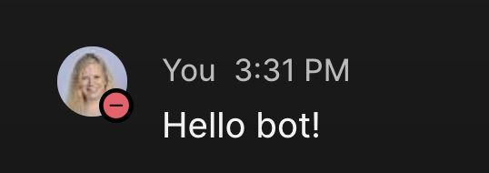

[Helper files](../help/README.md) | [Back to the cover page](./README.md)


# 2. Add an event: Webex bot and Webex Webhook

> **In this task you will**
> - Create a bot in developer.webex.com
> - Send Webex messages through an API
> - Create a Webhook that will alert your script when a message has been sent to your bot
> - Receive a configuration update through a Webex event

| Task | Name | Status |
| - | - | - |
| 1. | [Setup for your events: YANG models and NETCONF for configuration change](1.md) | ✅ |
| 2. | **Add an event: Webex bot and Webex Webhook** | ⬅️ |
| 3. | [Add an event: NetBox for source of truth](3.md) | ⬜ |
| 4. | [Add an event: Ticket system](4.md) | ⬜ |


**Task flow:**


## 2.1. Send and retrieve messages with Webex bot

Using Webex APIs is simple: The APIs are REST APIs, which means that there is an URL for each of the resources you can target (such as `messages`) and a method to be used (such as `GET` for retrieving and `POST` for creating data). These details are documented in [developer.webex.com](https://developer.webex.com). For authentication you need a Webex **token**. You could use your own personal token (and many times when testing you would do this!) but for scalable and secure development a bot would be created. Webex bot is a Webex user with limited visibility: they are perfect for automation, as they cannot see messages that are not sent to them.

> **Note**: If you are unfamiliar on REST APIs, you may refer to the helper file ["REST APIs and how to work with them"](../help/rest_api.md).

A Webex bot is combined of two parts:

1. Bot user *(has a token to authenticate API calls)* created in developer.webex.com
2. The actual logic for the bot (in your case, Python application to send and receive messages using the bot's token)

### 2.1.1 Create a bot in developer.webex.com

In the following steps you will create a bot user, which will allow you to use the Bot's token in your API calls.

> **Note**: Ask instructor for a Bot token if your account doesn't allow you to create your own.

**STEPS:**

<table>

<tr><th>Step</th><th width=50%>Description</th><th>Screenshot / code snippet</th></tr>

<tr><td>1.</td><td>

Navigate to [developer.webex.com](https://developer.webex.com) and login.

</td><td></td></tr>

<tr><td>2.</td><td>

Click `Documentation` on the top of the page, then `Bots` on the right side of the page, and finally the blue button `Create a Bot`.

</td><td>


</td></tr>
<tr><td>3.</td><td>

Give your bot a name, username, icon, and short description.
> **Note**: The username has to be unique.

</td><td>


</td></tr>
<tr><td>4.</td><td>

At the bottom of the page, click the blue `Add the bot`

</td></tr>
<tr><td>5.</td><td>

Your bot has been created! It doesn't yet have any capabilities, but it does have a token. Copy the token and paste it for example in a new file in Visual Studio Code as you won't see it again.

> **Note**: If you scroll down the page, you will find the other details of your bot. There is also an option to delete the bot.

</td><td>


</td></tr>
<tr><td>6.</td><td>

Send a message to your bot! Access your Webex through your Webex mobile application or through browser based GUI (https://web.webex.com/), search with your bot's username and start a 1:1 discussion with it.

</td><td>


</td></tr></table>

### 2.1.2 Reviewing documentation for the correct API call

The Webex REST APIs can be reviewed and accessed in the same website that you used for creating the bot: developer.webex.com. For the use case of sending and retrieving messages, you are interested in the `messages` API.

**STEPS:**

<table>

<tr><th>Step</th><th width=50%>Description</th><th>Screenshot / code snippet</th></tr>

<tr><td>1.</td><td>

In developer.webex.com `Documentation`, scroll down the menu on left until you see `Messaging` under `Webex APIs`.

</td><td></td>
</tr>

<tr><td>2.</td><td>

Click the `Messaging` to expand, then select `Reference` and `Messages`.

</td><td>


</td></tr>

<tr><td>3.</td><td>

As with YANG Suite, test using the API through the Swagger first. Click the API that lets you **Create a message** to open the interactive window.

</td><td>
<details>
<summary><strong> 💡 Step help (click to view) </strong></summary>


</details>
</td></tr>

<tr><td>4.</td><td>

On the left hand side you find more documentation on how to use the API. On the right hand side, you can try it out.

Note how the required components for this API call are included:
- Method and URL
- Header (Content-Type and Authorization)
- Body

</td><td>


</td></tr>

<tr><td>5.</td><td>

Fill details for the header: By default, the swagger uses your personal access token, but as you have already created one for your token, toggle `Use personal access token` and replace it with your bot's token.

</td><td>


</td></tr>

<tr><td>6.</td><td>

Fill details for the body:
- Write your own email in the `toPersonEmail` field. This way the bot sends a message to you!
- Write your preferred message in the `markdown` field.

</td><td>


</td></tr>

<tr><td>7.</td><td>

Click the yellow `Run` button (under the `attachments` field).

</td></tr>
<tr><td>8.</td><td>

When calling a Webex API, a JSON formatted response is returned. You can see this response together with the request details under the `Run` button.

</td><td>


</td></tr>

<tr><td>9.</td><td>

Check that you have received a 1:1 message from your bot in Webex using your Webex mobile application or the browser based GUI ([web.webex.com](https://web.webex.com)).

</td><td>


</td></tr>
</table>

### 2.1.3 Run a Python function to send Webex messages

You know now how the messages API works. Time to use what learned in documentation to create Python function for Webex messages!

In the following steps you will see how the same API you used through Webex swagger can be used through a Python script.

**STEPS:**

<table>

<tr><th>Step</th><th width=50%>Description</th><th>Screenshot / code snippet</th></tr>

<tr><td>1.</td><td>

Open `webex/config.py` in Visual Studio Code. This file will be read by the Webex function to retrieve details needed for the API call.

</td><td>

```bash
code webex/config.py
```

</td></tr>
<tr><td>2.</td><td>

Fill in your Webex bot token and your email address. Remember to **save** the `webex/config.py` file when ready.

> **Note**: In your MVP, the `config.py` will be imported. When you get further with your automation skills, the place for your bot token is not in a hard coded Python file, but in some source of truth such as HashiCorp Vault.

</td><td>

```python
webex_token = "put_here_your_bot_token"
my_email = "your@email.com"
```

</td></tr>
<tr><td>3.</td><td>

A function to send and retrieve messages have been created for you in `webex/webex_functions.py`. Run the Python file to send a test message from your bot to the email address you defined in previous step.

</td><td>

```bash
python webex/webex_functions.py
```

</td></tr>

<tr><td>4.</td><td>

Observe: 
- in Webex, a message has been sent to you by the bot
- in Visual Studio Code terminal, the API response has been printed out. The response is similar to what you investigated when running the API from the documentation.

</td><td>


</td></tr>
</table>

## 2.2. Events from Webex

When deploying ChatBots, it is important to have a good workflow to react to messages sent by a user. This can be done using **Webhooks**.

Webhook could be described as a reverse API: Instead of you calling to Webex API to ask if there are any new messages, Webex itself will send a message to you when something changes. For this you need something that listens for the message, and for the purpose of this lab, it is a Python based Flask application running in your pod.

### 2.2.1 Review Flask

Flask is a Python based web framework that allows us to listen to the incoming events. Flask is covered only on the need-to-know basis in this lab. If you get interested and want to learn more about it after the lab, check the extensive online documentation: https://flask.palletsprojects.com

**STEPS:**

<table>

<tr><th>Step</th><th width=50%>Description</th><th>Screenshot / code snippet</th></tr>

<tr><td>1.</td><td>

The Flask application is in the root with the name `main.py`. Open the file in Visual Studio Code for inspection.

</td><td>

```bash
code main.py
```

</td></tr>

<tr><td>2.</td><td>

Review the structure in `main.py`.

Pay attention to the following:
1. In the beginning of the file, `flask` library is imported which allows us to use the web framework.
2. In the beginning also `netconf`, `webex`, `netbox`, `tickets`, and `netbox_card` are imported. These are the *modules* you will use during this lab experience. By importing them, you have access to all the code that has been created for interacting with the different systems. We encourage you to look more into the scripts after the lab, if you are interested in how the API interactions are handled.
3. Every function in the `main.py` is paired with a decorator that defines the route on the server and the allowed method to use with that route. There is one for `/webex`, but also more for upcoming tasks.

</td><td>


</td></tr>
<tr><td>3.</td><td>

Focus on `@app.route("/webex", methods=["POST"])`: this means that when someone sends a `POST` requests against `https://<your_pod_address>/webex`, the function underneath it is going to be executed.

`request.json` shows the payload that was sent to the server - you will use this to capture the data sent by Webex Webhook.

</td><td>

```python
@app.route("/webex", methods=["POST"])
def webex_webhook():
    '''Function to be used with the Webex webhook'''

    event = request.json
    print(event)

    return "Received data!"

```

</td></tr>
<tr><td>4.</td><td>

Open a second terminal in Visual Studio Code. Change directory to `~/event-lab` and run the Flask app in port `12345` and in debug mode and allowing access from outside the pod's network.

> **Note**: You opened the second terminal in Visual Studio Code as you will leave the Flask application running until the end of the lab.
> By using the `debug` option, Flask app will be automatically reloaded when you make a change in the `main.py` file. This is an option that is useful in development, but should never be used in production.

</td><td>

```bash
cd ~/event-lab
flask --app main.py --debug run -p 12345 --host 0.0.0.0
```

You will see the following printed out when the server starts:
```bash
 * Serving Flask app 'main.py'
 * Debug mode: on
WARNING: This is a development server.
    Do not use it in a production deployment.
    Use a production WSGI server instead.
 * Running on all addresses (0.0.0.0)
 * Running on http://127.0.0.1:12345
Press CTRL+C to quit
 * Restarting with stat
 * Debugger is active!
 * Debugger PIN: 996-785-663
```
</td></tr>
</table>

### 2.2.2 Create a Webhook with the Bot token

Now that the server is running, you need to configure a webhook to send events to it. A webhook can be created through an API similarly as you did before with messages.

<table>
<tr><th>Step</th><th width=50%>Description</th><th>Screenshot / code snippet</th></tr>

<tr><td>1</td><td>

Run the `webex/get-webex-details.sh` script in the first Visual Studio Code terminal and copy the Webex Webhook URL that is displayed to the clipboard.

</td><td>
    
```bash
sh webex/get-webex-details.sh
```

<details>
<summary><strong> 💡 Example output (click to view) </strong></summary>

```text
$ sh webex/get-webex-details.sh

Webex webhook information:
    
External URL:       https://webhook-url.example.com:3389

```

</details>

</td></tr>

    
<tr><td>2.</td><td>

Navigate back to your browser and to the Webex API documentation in developer.webex.com. Find the link for `Webhook` API documentation, it is below the `Messaging` API you had open last.

</td><td>


</td></tr>
<tr><td>3.</td><td>

Select the correct method to `Create a Webhook`.

</td><td>
<details>
<summary><strong> 💡 Step help (click to view) </strong></summary>


</details></td></tr>
<tr><td>4.</td><td>

Start by toggling the `"Use personal access token"` and pasting your bot token in the Authorization field, like you did with the `messages` API. The next steps will guide you through the required details for Webhook creation.

</td><td>


</td></tr>
<tr><td>5.</td><td colspan=2>

In the `name` field, give your webhook a descriptive name.

</td></tr>
<tr><td>6.</td><td colspan=2>

`targetUrl` is the URL Webex should send a message when an event occurs. Use your Pods public url (provided in step 1 when you ran the `webex/get-webex-details.sh`) together with the route defined in Flask (`/webex`).

</td></tr>
<tr><td>7.</td><td colspan=2>

`resource` lets you define which resource's events you want to subscribe to. In your case this is `messages`, as you would like to know when a message is sent to your bot.

</td></tr>
<tr><td>8.</td><td colspan=2>

`event` lets you define which kind of events you are interested in. For the use case of this lab, the event should be `created` - we are only interested to hear about messages sent to the bot.
> **Note**:  You may refer to the documentation for detailed options on which events are supported with which resource.

</td></tr>
<tr><td>9.</td><td colspan=2>

For the use case of this lab, you should limit the scope, and filter only messages sent **from you** to the bot. Therefor for the `filter`, define `personEmail=<youremail>`.

</td></tr>
<tr><td>10.</td><td>

Your API fields should now look like in the screenshot (make sure you have used your own email and your own pod's url instead of the ones in the screenshot).

Click `Run` to create the Webhook.

</td><td>


</td></tr>

<tr><td>11.</td><td>

Test your webhook! Navigate back to Webex and send a message to your Bot.

</td><td>


</td></tr>
<tr><td>12.</td><td>

Open the Visual Studio Code terminal window where you have Flask running. Observe that the application received your message.

> **Note**: If you do not see the message in your Flask app terminal, ask your instructor to help you before proceeding to the next section.

</td><td>

```bash
{'id': 'Y2lzY29zcGFyazovL3VzL1dFQkhP..' ....}
128.107.223.246 - - [24/May/2023 12:48:26] "POST /webex HTTP/1.1" 200 -
```

</td></tr></table>

### 2.2.3 Adjust the `main.py` to properly read the Webex message

Excellent, an event has been received! However... it is only a message about the event - for security reasons the webhook will never send the message itself, that one you will have to retrieve separately with the bot's token as authentication.

<table>
<tr><th>Step</th><th width=50%>Description</th><th>Screenshot / code snippet</th></tr>

<tr><td>1.</td><td>

Investigate the payload that was sent to you. Note how there is a key `"data"` that includes the details of the actual message, including its `"id"`.

</td><td>
<details>
<summary><strong> 💡 Example payload with pretty print (click to view) </strong></summary>

```
{
    'id': 'Y2lzY29zcGFyazovL3VzL1dFQkhPT0svM2ExZDRlMDktMDRhMC00MjkxLWFjNDYtYWEzN2VjYjI4YTVl',
    'name': 'Cisco Live',
    'targetUrl': 'https://<YOUR_POD>/webex',
    'resource': 'messages',
    'event': 'created',
    'filter': 'personEmail=jusantal@cisco.com',
    'orgId': 'Y2lzY29zcGFyazovL3VzL09SR0FOSVpBVElPTi8xZWI2NWZkZi05NjQzLTQxN2YtOTk3NC1hZDcyY2FlMGUxMGY',
    'createdBy': 'Y2lzY29zcGFyazovL3VzL1BFT1BMRS9mOWZjZGU5My01YTdkLTRmZjUtOWY3Yy03ZWNhZDBjNTY1Yzk',
    'appId': 'Y2lzY29zcGFyazovL3VzL0FQUExJQ0FUSU9OL0MzMmM4MDc3NDBjNmU3ZGYxMWRhZjE2ZjIyOGRmNjI4YmJjYTQ5YmE1MmZlY2JiMmM3ZDUxNWNiNGEwY2M5MWFh',
    'ownedBy': 'creator',
    'status': 'active',
    'created': '2023-05-24T13:06:59.342Z',
    'actorId': 'Y2lzY29zcGFyazovL3VzL1BFT1BMRS9mZjJkMWIzNi02NDM1LTRlOTctOGE0OS0xMTc5ZmE2MmEzNTU',
    'data': {
        'id': 'Y2lzY29zcGFyazovL3VzL01FU1NBR0UvZjI3Y2U3MzAtZmE2Yi0xMWVkLWIxNTktMWQ5ZDQ3YzAxOWQy',
        'roomId': 'Y2lzY29zcGFyazovL3VzL1JPT00vNjQzOGNlZDAtZjg5YS0xMWVkLTljZWQtZGJiYWZlNDY5YjJh',
        'roomType': 'direct',
        'personId': 'Y2lzY29zcGFyazovL3VzL1BFT1BMRS9mZjJkMWIzNi02NDM1LTRlOTctOGE0OS0xMTc5ZmE2MmEzNTU',
        'personEmail': 'jusantal@cisco.com',
        'created': '2023-05-24T19:48:25.507Z'
    }
}
```

</details>
</td></tr>
<tr><td>2.</td><td>

After the line with `event = request.json`, create a variable named `message_id` to store the value of `event["data"]["id"]`. On the next line, use the `get_message` function from the `webex` module. Use your bot's token that is imported in the beginning of the file (`webex.webex_token`) with the `id` of the message that generated the event.

> **Note**: Make sure not to remove the `return "Received data!"` from the end of the function! The function has to have a return statement to work properly.

> **Note**: The `config.py` values `webex_token` and `my_email` are imported at the `import webex` in the beginning of the file. When you get more experienced with automation, you would not hard code like this. Instead you would include functionality to fetch the values from your source of truth instead (for example from Vault).

</td><td>

```python
@app.route("/webex", methods=["POST"])
def webex_webhook():
    '''Function to be used with the Webex webhook'''

    event = request.json
    print(event)

    message_id = event["data"]["id"]
    message_data = webex.get_message(webex.webex_token, message_id)

    return "Received data!"
```

</td></tr>
<tr><td>3.</td><td>

Add a `print` statement to print on the screen the message retrieved with the `"id"`. To reduce clutter, you may comment out the `print(event)`.

</td><td>
<details>
<summary><strong> 💡 Step help (click to view) </strong></summary>


```python
@app.route("/webex", methods=["POST"])
def webex_webhook():
    '''Function to be used with the Webex webhook'''

    event = request.json
    # print(event)

    message_id = event["data"]["id"]
    message_data = webex.get_message(webex.webex_token, message_id)
    print(message_data)

    return "Received data!"
```

</details>
</td></tr>
<tr><td>4.</td><td>

Save `main.py`, and test the new lines by sending a new message to your bot in Webex.
</td></tr>

<tr><td>5.</td><td>

Review the terminal where Flask is running. Now you can see the message returned under the key `"text"`!

</td><td>

```bash
Retrieving message: Y2lzY29zcGFyazovL3VzL01FU1NBR0UvY...
Status code of retrieving the Webex message: 200
{'id': 'Y2lzY29zcGFyazovL3VzL01FU1NBR0UvYWJmY2IyMzAt...',
'roomId': 'Y2lzY29zcGFyazovL3VzL1JPT00vNjQzOGNlZDAtZ...',
'roomType': 'direct',
'text': 'Hello bot!',
'personId': 'Y2lzY29zcGFyazovL3VzL1BFT1BMRS9mZjJkMWI...',
'personEmail': 'jusantal@cisco.com', 'created': '...'}
x.x.x.x - - [24/May/2023 12:53:37] "POST /webex HTTP/1.1" 200 -
```

</td></tr>

<tr><td>6.</td><td>

Add one more line where you extract the message (under key `"text"`) from the payload, and another line to `print` the message on the terminal. Again, to reduce clutter, comment out the previous print statement.

</td><td>
<details>
<summary><strong> 💡 Step help (click to view) </strong></summary>


```python
@app.route("/webex", methods=["POST"])
def webex_webhook():
    '''Function to be used with the Webex webhook'''

    event = request.json
    # print(event)

    message_id = event["data"]["id"]
    message_data = webex.get_message(webex.webex_token, message_id)
    print(message_data)

    message = message_data["text"]
    print(message)

    return "Received data!"
```

</details>
</td></tr>
<tr><td>7.</td><td>

Send one more test message to your bot in Webex, and review from the terminal where Flask is running that your message was printed out successfully.

</td><td>

```bash
Retrieving message: Y2lzY29zcGFyazovL3VzL01FU1NBR0UvZDg...
Status code of retrieving the Webex message: 200
Hello bot!
128.107.223.246 - - [24/May/2023 12:54:51] "POST /webex HTTP/1.1" 200 -
```

</td></tr></table>

### 2.2.4 Connect the Webex event to configuration change

Lets tie the Webex event to a configuration change request: every time your Webex message to the bot starts with `Configure:`, your script will receive the configuration that was defined after the word `Configure:`.

**STEPS:**
<table>

<tr><th>Step</th><th width=50%>Description</th><th>Screenshot / code snippet</th></tr>

<tr><td>1.</td><td>

In `main.py`, add `if` statement under the Webhook path to check if the message starts with `"Configure:"`. If the condition is true, use the function you created for configuration changes to change the description to the text that follows `Configure:`.

</td><td>


```python
if message[:10] == "Configure:":
    configuration = message[10:].strip()
    print(configuration)
```
</td></tr>
<tr><td>2.</td><td>

Add also a line where the bot responds telling that configuration has been changed by using the `webex.send_message` function. The `webex.send_message` function takes three arguments: `webex.webex_token`, `webex.my_email`,
and the message you want to send.
    
Now the full function under route `"/webex"` looks like the following. Remember to save the `main.py` file after the changes.

</td><td>

```python
@app.route("/webex", methods=["POST"])
def webex_webhook():
    '''Function to be used with the Webex webhook'''
    event = request.json
    # print(event)

    message_id = event["data"]["id"]
    message_data = webex.get_message(webex.webex_token, message_id)
    # print(message_data)

    message = message_data["text"]
    # print(message)

    if message[:10] == "Configure:":
        configuration = message[10:].strip()
        print(configuration)
        webex.send_message(webex.webex_token, webex.my_email,
                        f"Configuration requests received: '{configuration}'")

    return "Received data!"
```

</td></tr>
<tr><td>3.</td><td>

Send your bot a message starting with the word `Configure:`. The bot responds to you once it has received the configuration request!

</td><td>


</td></tr>
<tr><td>4.</td><td colspan=2>

**Congratulations!** You have created your first event driven logic!

Making a change through a free form Webex message is a good start on your event driven automation, however it is not the most scalable or easily usable way to maintaining your configuration. In the next task you will introduce source of truth and use that together with Webex to initiate your network changes.

</td></tr>
</table>

## Check-list before continuing

Before continuing to the next task, you should have completed the following:

- [x] **Retrieved a bot token**
- [x] **Sent Webex message from your bot through an API**
- [x] **Created Webex Webhook and integrated that with Flask application**
- [x] **Sent a configuration change request to a ChatBot**

<table>
<tr><th>Description</th><th>Screenshot / code snippet</th></tr>

<tr><td>

**If you did not manage to complete all the steps in this task, run the following script in the Visual Studio Code terminal before continuing to the next task.**

</td><td>

```bash
sh webex/complete_lab.sh
```

</td></tr>
</table>


<p align="center">
<a href="./1.md"></a>
<a href="./3.md"></a>
</p>


