[Helper files](../help/README.md) | [Back to the cover page](./README.md)


# 3. Add an event: Netbox for source of truth

> **In this task you will**
> - Create a webhook in NetBox that triggers when an interface is updated.
> - Add an endpoint to your Flask app for the incoming NetBox webhook data.
> - Use the NetBox data to configure an interface using the script from Task 1.

| Task | Name | Status |
| - | - | - |
| 1. | [Setup for your events: YANG models and NETCONF for configuration change](1.md) | ✅ |
| 2. | [Add an event: Webex bot and Webex Webhook](2.md) | ✅ |
| 3. | **Add an event: NetBox for source of truth** | ⬅️ |
| 4. | [Add an event: Ticket system](4.md) | ⬜ |


**Task flow:**

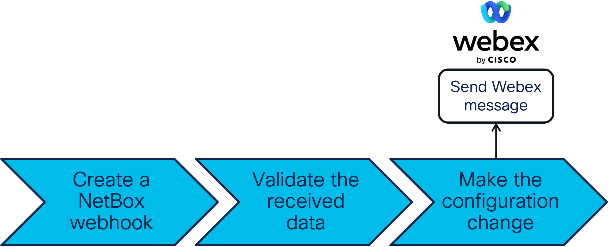


## 3.1 NetBox as a Source of Truth

In the previous task you used Webex message as the source of your configuration change. As you progress in your network automation journey, you will find that a REST-enabled Source of Truth is a critical component to a successful NetDevOps strategy. Any approved network changes should start with a Source of Truth, which provides the following benefits:
- Instantly-available documentation in a central location.
- Tracking changes made across the network by teammates.
- Improved disaster recovery (all desired state is stored in the Source of Truth).
- And more!

There are multiple options to use: Your source of truth could be for example a `YAML` file, Cisco DNA Center inventory, or NetBox. In this task you will use NetBox which provides a fully-featured REST API, but the logic is easily adaptable to other tools. Full documentation on Netbox APIs is available at the [NetBox documentation](https://docs.netbox.dev/en/stable/) site.

> **Note**: You can use an HTTP client such as the Python `requests` library to interact with the NetBox API by authenticating with a token stored in an `Authorization` request header - but there is an easier way using the `pynetbox` Python package. More information about `pynetbox` can be found at the [pynetbox documentation](https://pynetbox.readthedocs.io/en/latest/) site. 

### 3.1.1 Create a webhook in NetBox

In the following steps, you will access your NetBox instance and configure a webhook to send data when an interface is updated in NetBox. You will notice many similarities to Webex Webhook creation, as the underlying logic is the same.

>**Note**: The configuration data is pre-populated in your Pod's NetBox. The focus of this task is to create the Webhook to receive changes done in this existing data. How NetBox itself is setup is out of scope for this lab - however your lab instructor is happy to sit down with you during Cisco Live to talk more about it.

**STEPS:**

<table>

<tr><th>Step</th><th width=50%>Description</th><th>Screenshot / code snippet</th></tr>

<tr><td>1.</td><td>

Run the `netbox/get-netbox-details.sh` script in the Visual Studio Code terminal and copy the NetBox URL that is displayed to the clipboard.

</td><td>

```bash
sh netbox/get-netbox-details.sh
```

<details>
<summary><strong> 💡 Example output (click to view) </strong></summary>

```text
$ sh netbox/get-netbox-details.sh

NetBox Access Details:

NetBox URL:       https://netbox-url.example.com:1234
NetBox Username:  netbox_username
NetBox Password:  netbox_password

```
</details>

</td></tr>
<tr><td>2.</td><td>

Open a new tab in the browser and paste the NetBox URL. Click **Log In** in the top right and use the credentials from step 1 to login.

</td><td>

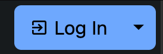

<hr />

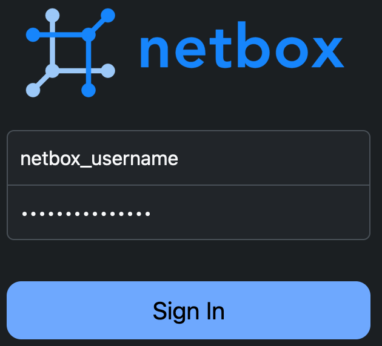

</td></tr>
<tr><td>3.</td><td>

Click **Operations** in the left menu bar to open the sub-menu, then click **Webhooks** to open the webhook configuration page.

</td><td>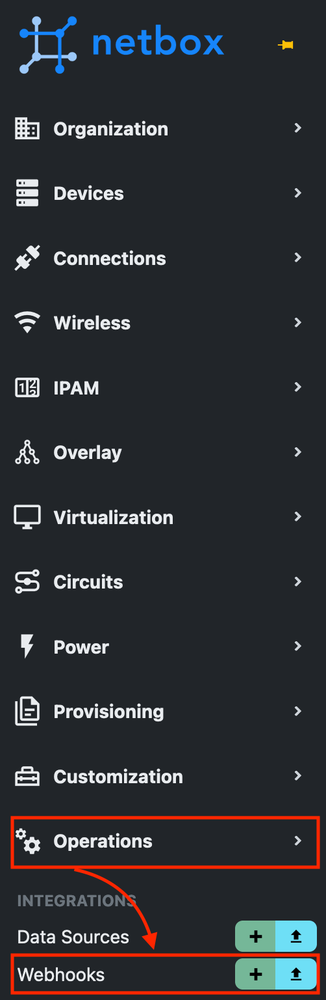
</td></tr>
<tr><td>4.</td><td>

Click **+ Add** in the top right to open the *Add a new webhook* page.

</td><td>

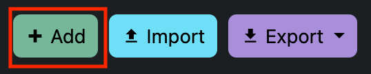

</td></tr>
<tr><td>5.</td><td>

Give the webhook a meaningful name, such as **Interface webhook**. For **Content types**, select **DCIM > Interface**. Ensure **Enabled** is **checked** and that **Updates** is **checked** under **Events**. 

</td><td>

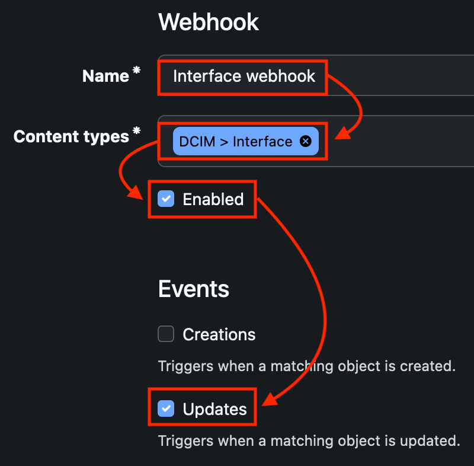

</td></tr>
<tr><td>6.</td><td>

Scroll to the **HTTP Request** section of the webhook creation page. Set the **URL** to `http://apihost:12345/netbox`, select **POST** as the **HTTP method**, and set **HTTP content type** to `application/json`

> **Note**: As the NetBox is running in container in your pod, you can target the internal `https://apihost:12345` instead of your pod's public address that you used with Webex. The logic in the address is still the same as with Webex events - you will later on work on the Flask function executed under the route `/netbox`.

</td><td>

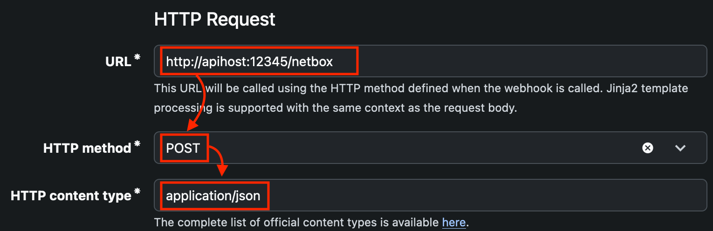

</td></tr>
<tr><td>7.</td><td>

For this webhook, no additional information is required. Scroll to the bottom of the page and click **Save**

> **Note**: There are many options available to customize NetBox webhooks. For more information, see the [NetBox Webhook documentation](https://docs.netbox.dev/en/stable/integrations/webhooks/).

</td><td>

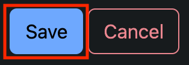

</td></tr>
<tr><td>8.</td><td>

After saving, you will be redirected to the Webhook summary page. Your output should be similar to the following:

</td><td>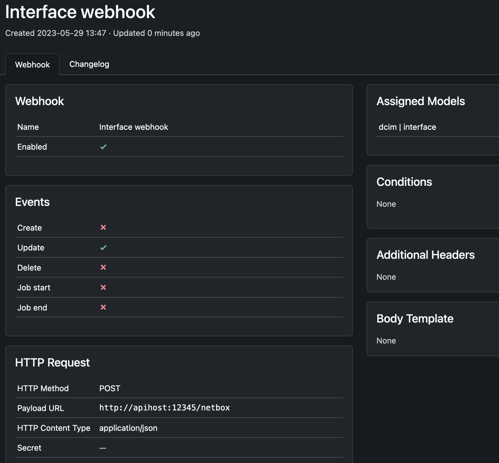
</td></tr>
<tr><td>9.</td><td>

In Visual Studio Code, ensure the Flask app is still running in the second terminal. If Flask is not running, start the app.

</td><td>

Do the following only if Flask is not running anymore!

```bash
flask --app main.py --debug run -p 12345 --host 0.0.0.0
```

</td></tr>
<tr><td>10.</td><td>

Return to NetBox in the browser. Click **Devices** in the left menu, then click **Devices** in the sub menu.

</td><td>

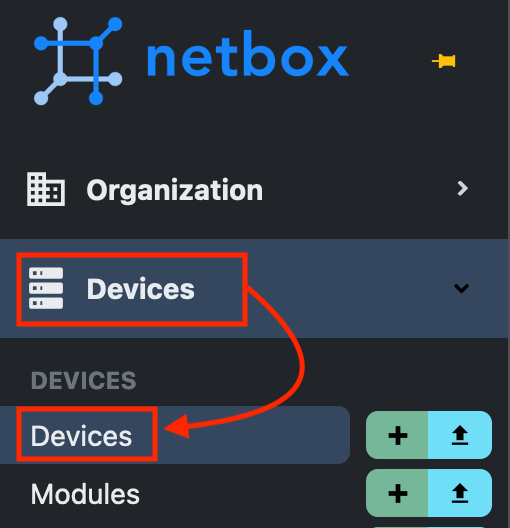

</td></tr>
<tr><td>11.</td><td>

Click the **c9300** in the Devices list.

</td><td>

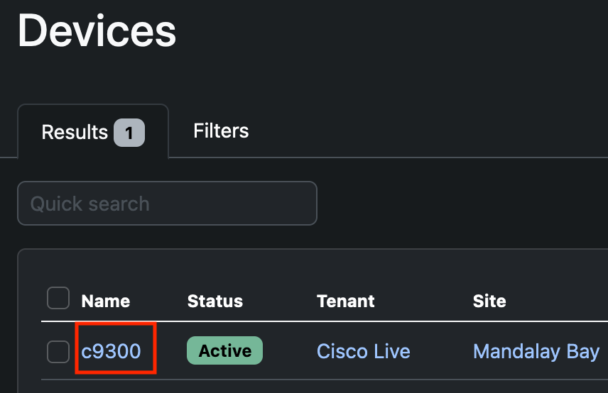

</td></tr>
<tr><td>12.</td><td>

Review the device information for your lab switch. Notice the Management information, the Device Type, and the Custom Field named "Change Ticket Number".

</td><td>
</td></tr>
<tr><td>13.</td><td>

Click **Interfaces** in the top menu of the c9300 device screen.

</td><td>

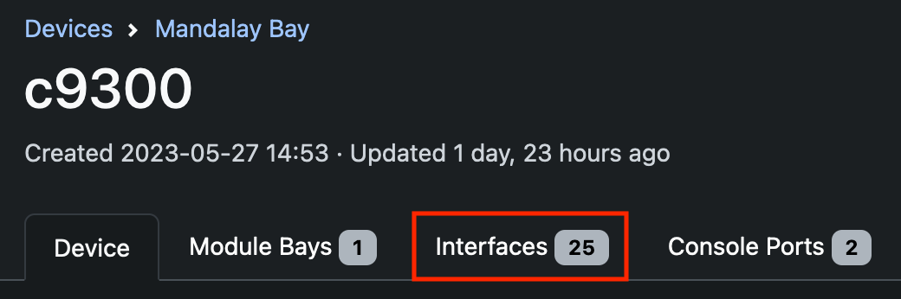

</td></tr>
<tr><td>14.</td><td>

Click interface **GigabitEthernet1/0/2** and review the available interface settings on the page that appears. Notice that many common settings are available for interfaces such as interface description, MTU, interface state, switchport mode, and many more.

> **Note**: Interface GigabitEthernet1/0/1 is not accessible because it is used for lab connectivity. This is to prevent automated events from NetBox from disconnecting your lab switch.

</td><td>

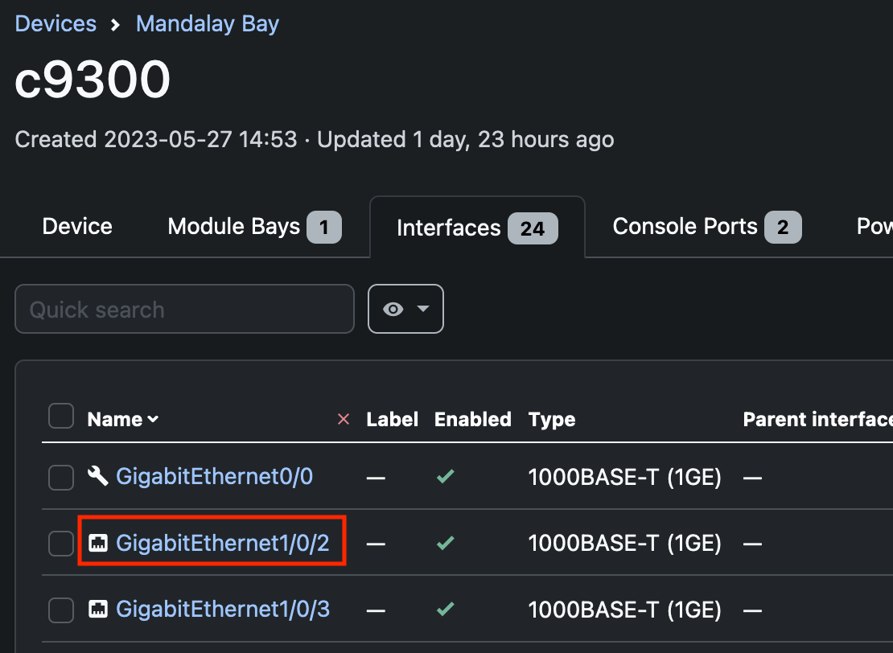

</td></tr>
<tr><td>15.</td><td>

After you have reviewed the interface configuration, click the **Edit** button in the top right menu.

</td><td>

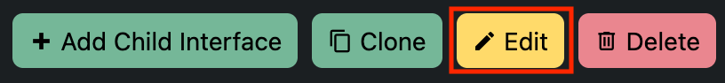

</td></tr>
<tr><td>16.</td><td>

Add a description for the interface, then scroll to the bottom of the interface page and click **Save**

</td><td>

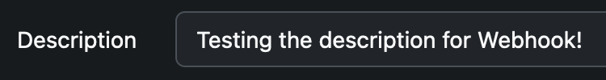

</td></tr>
<tr><td>17.</td><td>

Return to the Visual Studio Code terminal where Flask is running. If your NetBox interface webhook was created successful, you should see a POST to the `/netbox` endpoint followed by the output of the received webhook payload in JSON format.

> **Note**: By default, printed JSON data will be on a single line. It is formatted in the  example output here for readability. You can use this example output as a reference to guide you in the remaining tasks.

</td><td>
<details>
<summary><strong> 💡 Example output (click to view) </strong></summary>

```python
{
  'event': 'updated',
  'timestamp': '2023-05-29 14:42:55.994068+00:00',
  'model': 'interface',
  'username': 'developer',
  'request_id': '40ba0ffd-af8d-4441-bfca-e59592a97bb2',
  'data': {
    'id': 3,
    'url': '/api/dcim/interfaces/3/',
    'display': 'GigabitEthernet1/0/2',
    'device': {
      'id': 1,
      'url': '/api/dcim/devices/1/',
      'display': 'c9300',
      'name': 'c9300'
    },
    'vdcs': [],
    'module': None,
    'name': 'GigabitEthernet1/0/2',
    'label': '',
    'type': {
      'value': '1000base-t',
      'label': '1000BASE-T (1GE)'
    },
    'enabled': True,
    'parent': None,
    'bridge': None,
    'lag': None,
    'mtu': None,
    'mac_address': None,
    'speed': None,
    'duplex': None,
    'wwn': None,
    'mgmt_only': False,
    'description': 'Testing the description for Webhook!',
    'mode': None,
    'rf_role': None,
    'rf_channel': None,
    'poe_mode': None,
    'poe_type': None,
    'rf_channel_frequency': None,
    'rf_channel_width': None,
    'tx_power': None,
    'untagged_vlan': None,
    'tagged_vlans': [],
    'mark_connected': False,
    'cable': None,
    'cable_end': '',
    'wireless_link': None,
    'link_peers': [],
    'link_peers_type': None,
    'wireless_lans': [],
    'vrf': None,
    'l2vpn_termination': None,
    'connected_endpoints': None,
    'connected_endpoints_type': None,
    'connected_endpoints_reachable': None,
    'tags': [],
    'custom_fields': {
      'change_ticket_number': None
    },
    'created': '2023-05-27T14:53:43.715118Z',
    'last_updated': '2023-05-29T14:42:55.917358Z',
    'count_ipaddresses': 0,
    'count_fhrp_groups': 0,
    '_occupied': False
  },
  'snapshots': {
    'prechange': {
      'created': '2023-05-27T14:53:43.715Z',
      'last_updated': '2023-05-29T14:22:36.937Z',
      'device': 1,
      'name': 'GigabitEthernet1/0/2',
      'label': '',
      'description': '',
      'module': None,
      'cable': None,
      'cable_end': '',
      'mark_connected': False,
      'enabled': True,
      'mac_address': None,
      'mtu': None,
      'mode': '',
      'parent': None,
      'bridge': None,
      'lag': None,
      'type': '1000base-t',
      'mgmt_only': False,
      'speed': None,
      'duplex': None,
      'wwn': None,
      'rf_role': '',
      'rf_channel': '',
      'rf_channel_frequency': None,
      'rf_channel_width': None,
      'tx_power': None,
      'poe_mode': '',
      'poe_type': '',
      'wireless_link': None,
      'untagged_vlan': None,
      'vrf': None,
      'vdcs': [],
      'wireless_lans': [],
      'tagged_vlans': [],
      'custom_fields': {
        'change_ticket_number': None
      },
      'tags': []
    },
    'postchange': {
      'created': '2023-05-27T14:53:43.715Z',
      'last_updated': '2023-05-29T14:42:55.917Z',
      'device': 1,
      'name': 'GigabitEthernet1/0/2',
      'label': '',
      'description': 'Testing the description for Webhook!',
      'module': None,
      'cable': None,
      'cable_end': '',
      'mark_connected': False,
      'enabled': True,
      'mac_address': None,
      'mtu': None,
      'mode': '',
      'parent': None,
      'bridge': None,
      'lag': None,
      'type': '1000base-t',
      'mgmt_only': False,
      'speed': None,
      'duplex': None,
      'wwn': None,
      'rf_role': '',
      'rf_channel': '',
      'rf_channel_frequency': None,
      'rf_channel_width': None,
      'tx_power': None,
      'poe_mode': '',
      'poe_type': '',
      'wireless_link': None,
      'untagged_vlan': None,
      'vrf': None,
      'vdcs': [],
      'wireless_lans': [],
      'tagged_vlans': [],
      'custom_fields': {
        'change_ticket_number': None
      },
      'tags': []
    }
  }
}

```
```text
192.168.16.7 - - [29/May/2023 07:42:56] "POST /netbox HTTP/1.1" 200 -
```

</details>
</td></tr>
</table>

### 3.1.2 Add a endpoint to your Flask app

Now that you have configured the NetBox webhook and verified that it is functional, you must add code to Flask to validate the webhook data before performing other tasks. Validation is an important task - you will want to catch wrong data before it reaches the network, as well as want to keep the automation logic (Flask) running even if an error occurs.

> **Note**: As the focus of this lab are events and how to link them together, many of the NetBox related scripts are pre-created in `netbox` folder / module. Feel free to look into these functions more after the lab or at the end of the lab if you have extra time.

<table>

<tr><th>Step</th><th width=50%>Description</th><th>Screenshot / code snippet</th></tr>

<tr><td>1.</td><td>

Open the `main.py` file in Visual Studio Code if not open already.

</td><td>

```bash
code main.py
```

</td></tr>
<tr><td>2.</td><td>

Locate the function that handles incoming `POST` data to the `/netbox` endpoint. It should look quite similar to what the `/webex` endpoint looked like in the beginning of the Webex task.

</td><td>

```python
@app.route("/netbox", methods=["POST"])
def netbox_webhook():
    '''Function to be used with the NetBox webhook'''

    event = request.json
    print(event)

    return "Received NetBox event!"
```

</td></tr>
<tr><td>3.</td><td>

Below the `print` statement, add code to send a Webex message stating that NetBox data was received.

> **Note**: If you forgot how to send a message with the functions created in `webex` module, check back to the `/webex` endpoint to remind yourself!

</td><td>
<details>
<summary><strong> 💡 Step help (click to view) </strong></summary>

```python
@app.route("/netbox", methods=["POST"])
def netbox_webhook():
    '''Function to be used with the NetBox webhook'''

    event = request.json
    print(event)
    
    webex.send_message(webex.webex_token, webex.my_email, "Webhook data received from NetBox!")

    return "Received NetBox event!"
```

</details>
</td></tr>
<tr><td>4.</td><td>

Below the `webex.send_message()` call, create a variable named `webhook_details` that stores the value of `event.get("data", {})`

> **Note**: The Python dictionary `get()` method provides a safe way to access data in a dictionary. If the requested key is not present, a default value will be generated. The default value is `None` but can be changed with the second parameter to the `get()` method. In your code, a default value of `{}` will be created if the key `data` does not exist. `{}` is an empty dictionary, so you can use the `get()` method against it without fear of an exception being raised. 

</td><td>
<details>
<summary><strong> 💡 Step help (click to view) </strong></summary>

```python
@app.route("/netbox", methods=["POST"])
def netbox_webhook():
    '''Function to be used with the NetBox webhook'''

    event = request.json
    print(event)

    webex.send_message(webex.webex_token, webex.my_email, "Webhook data received from NetBox!")
    webhook_details = event.get("data", {})

    return "Received NetBox event!"
```

</details>
</td></tr>
<tr><td>5.</td><td>

Create a conditional statement using `if` to test if there is a value in the `change_ticket_number` custom field data. Use the Python dictionary `get()` method to extract `custom_fields` from the `webhook_details` variable, with a default of `{}`. Add a second `get()` method to extract the custom field `change_ticket_number` with a default value of None if it does not exist.

> **Note**: In later tasks, you might trigger a NetBox webhook that should **not** be acted on. This conditional will help prevent infinite loops if no change ticket has been assigned.

</td><td>
<details>
<summary><strong> 💡 Step help (click to view) </strong></summary>

```python
@app.route("/netbox", methods=["POST"])
def netbox_webhook():
    '''Function to be used with the NetBox webhook'''

    event = request.json
    print(event)

    webex.send_message(webex.webex_token, webex.my_email, "Webhook data received from NetBox!")
    webhook_details = event.get("data", {})

    if webhook_details.get("custom_fields", {}).get("change_ticket_number", None):

    return "Received NetBox event!"
```

</details>
</td></tr>
<tr><td>6.</td><td>

Inside the new conditional block, begin a `try..except..else` statement. In the `try` statement, create a new variable named `validated_data` to store the value of `netconf.validate_data(webhook_details)`. Also, call the function `netbox.get_device_mgmt_ipv4()` with parameter `validated_data.device_name` to get the management IP address of the device sent by the webhook, and store the result in a variable named `mgmt_ip`.

</td><td>
<details>
<summary><strong> 💡 Step help (click to view) </strong></summary>

```python
@app.route("/netbox", methods=["POST"])
def netbox_webhook():
    '''Function to be used with the NetBox webhook'''

    event = request.json
    print(event)

    webex.send_message(webex.webex_token, webex.my_email, "Webhook data received from NetBox!")
    webhook_details = event.get("data", {})

    if webhook_details.get("custom_fields", {}).get("change_ticket_number", None):
        try:
            validated_data = netconf.validate_data(webhook_details)
            mgmt_ip = netbox.get_device_mgmt_ipv4(validated_data.device_name)

    return "Received NetBox event!"
```

</details>
</td></tr>
<tr><td>7.</td><td>

Add the code to catch any raised `Exception` as `err`. If an exception is caught, send a Webex message stating that there is a problem validating the data and include the value of the `err` variable.

</td><td>
<details>
<summary><strong> 💡 Step help (click to view) </strong></summary>

```python
@app.route("/netbox", methods=["POST"])
def netbox_webhook():
    '''Function to be used with the NetBox webhook'''

    event = request.json
    print(event)

    webex.send_message(webex.webex_token, webex.my_email, "Webhook data received from NetBox!")
    webhook_details = event.get("data", {})

    if webhook_details.get("custom_fields", {}).get("change_ticket_number", None):
        try:
            validated_data = netconf.validate_data(webhook_details)
            mgmt_ip = netbox.get_device_mgmt_ipv4(validated_data.device_name)            
        except Exception as err:
            webex.send_message(webex.webex_token, webex.my_email, f"There was a problem validating the webhook data:\n{err}")

    return "Received NetBox event!"
```

</details>
</td></tr>
<tr><td>8.</td><td>

To complete the `try..except..else` code, add an `else` statement. Add code to send a message stating that the webhook data is valid and the device will be configured.

> **Note**:  In a `try..except..else` statement, the `else` statement will *only* run if no exceptions were caught. In the `netbox_webhook` function you writing, the remaining code will only be executed if valid data was received by the webhook and the device management IP has been obtained. This is an easy way to ensure that errors will not crash your code!

</td><td>
<details>
<summary><strong> 💡 Step help (click to view) </strong></summary>

```python
@app.route("/netbox", methods=["POST"])
def netbox_webhook():
    '''Function to be used with the NetBox webhook'''

    event = request.json
    print(event)

    webex.send_message(webex.webex_token, webex.my_email, "Webhook data received from NetBox!")
    webhook_details = event.get("data", {})

    if webhook_details.get("custom_fields", {}).get("change_ticket_number", None):
        try:
            validated_data = netconf.validate_data(webhook_details)
            mgmt_ip = netbox.get_device_mgmt_ipv4(validated_data.device_name)
        except Exception as err:
            webex.send_message(webex.webex_token, webex.my_email, f"There was a problem validating the webhook data:\n{err}")
        else:
            webex.send_message(webex.webex_token, webex.my_email, "Valid data received, configuring the device.")

    return "Received NetBox event!"
```

</details>
</td></tr>
<tr><td>9.</td><td>

Inside the `else` statement, use an `if` statement to test if the result of configuring the device is successful. You will use the `netconf.configure_interface()` function from the script used in the first lab task. Pass the `configure_interface()` function two **named parameters**:
- Parameter 1: `device_mgmt_ip=mgmt_ip`
- Parameter 2: `template_data=validated_data.dict()`

If the conditional passes, send another Webex message indicating that the configuration was successful. Otherwise, send a message that the configuration task failed.

> **Note**: The pre-built function `netconf.validate_data` returns a data structure generated by a Python package named `pydantic`. You can access a dictionary representation of the validated model using the `.dict()` method.

> **Note**: The `configure_interface` function takes many parameters. When you validated the incoming data and saved to the variable named `validated_data`, it created all parameters needed for the interface configuration task **except** for the device management IP. By passing this data with the special `**` prefix, you are instructing Python to treat the dictionary as named parameters to the `configure_interface` function. For more information, see the [Python documentation for defining functions and named parameters](https://docs.python.org/3/tutorial/controlflow.html#more-on-defining-functions) 

</td><td>
<details>
<summary><strong> 💡 Step help (click to view) </strong></summary>

```python
@app.route("/netbox", methods=["POST"])
def netbox_webhook():
    '''Function to be used with the NetBox webhook'''

    event = request.json
    print(event)

    webex.send_message(webex.webex_token, webex.my_email, "Webhook data received from NetBox!")
    webhook_details = event.get("data", {})

    if webhook_details.get("custom_fields", {}).get("change_ticket_number", None):
        try:
            validated_data = netconf.validate_data(webhook_details)
            mgmt_ip = netbox.get_device_mgmt_ipv4(validated_data.device_name)
        except Exception as err:
            webex.send_message(webex.webex_token, webex.my_email, f"There was a problem validating the webhook data:\n{err}")
        else:
            webex.send_message(webex.webex_token, webex.my_email, "Valid data received, configuring the device.")
    
            if netconf.configure_interface(device_mgmt_ip=mgmt_ip, template_data=validated_data.dict()):
                webex.send_message(webex.webex_token, webex.my_email, "Device has been configured!")
            else:
                webex.send_message(webex.webex_token, webex.my_email, "There was a problem configuring the device, check the Flask output for details.")

    return "Received NetBox event!"
```

</details>
</td></tr>
<tr><td>10.</td><td>

Add the final code to remove the `Change Ticket Number` custom field data, using the `netbox.clear_change_ticket_number_from_interface()` function. Pass the parameters `validated_data.device_name` and `validated_data.interface_name`.

> **Note**: The code to clear the change ticket number should be added so that it will execute whether the configuration change was successful or not. This will ensure that the same webhook does not get processed if triggered again **unless** a ticket number is present.

</td><td>
<details>
<summary><strong> 💡 Step help (click to view) </strong></summary>

```python
@app.route("/netbox", methods=["POST"])
def netbox_webhook():
    '''Function to be used with the NetBox webhook'''

    event = request.json
    print(event)

    webex.send_message(webex.webex_token, webex.my_email, "Webhook data received from NetBox!")
    webhook_details = event.get("data", {})

    if webhook_details.get("custom_fields", {}).get("change_ticket_number", None):
        try:
            validated_data = netconf.validate_data(webhook_details)
            mgmt_ip = netbox.get_device_mgmt_ipv4(validated_data.device_name)
        except Exception as err:
            webex.send_message(webex.webex_token, webex.my_email, f"There was a problem validating the webhook data:\n{err}")
        else:
            webex.send_message(webex.webex_token, webex.my_email, "Valid data received, configuring the device.")
    
            if netconf.configure_interface(device_mgmt_ip=mgmt_ip, template_data=validated_data.dict()):
                webex.send_message(webex.webex_token, webex.my_email, "Device has been configured!")
            else:
                webex.send_message(webex.webex_token, webex.my_email, "There was a problem configuring the device, check the Flask output for details.")

            netbox.clear_change_ticket_number_from_interface(validated_data.device_name, validated_data.interface_name)

    return "Received NetBox event!"
```

</details>
</td></tr>
</table>

### 3.1.3 Configure an interface using the NetBox webhook data

The validation of received NetBox webhook data is now completed. Making a change in NetBox should now be received, and based on whether the data is valid or not, a Webex message will be sent and the configuration change executed.

<table>
<tr><th>Step</th><th width=50%>Description</th><th>Screenshot / code snippet</th></tr>

<tr><td>1.</td><td>

Test the webhook! Return to your browser and the NetBox `Interfaces` page. Edit interface `GigabitEthernet1/0/2`.

</td><td>

> **Hint** : On the NetBox Interfaces page, you can click the yellow pencil icon to the right of the interface name to quickly open the edit dialog for a single interface.

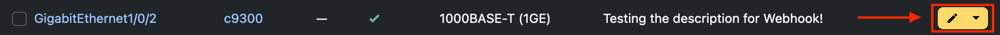

</td></tr>
<tr><td>2.</td><td>

Change the interface description and add a ticket number to the `Change Ticket Number` custom field. Click **Save** to save your changes and trigger the webhook.

</td><td>

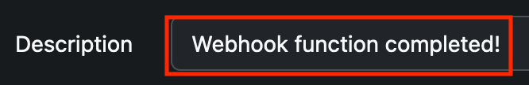

<hr />

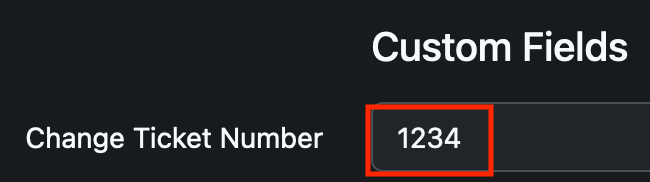

</td></tr>
<tr><td>3.</td><td>

Return to your Flask app in the Visual Studio Code terminal. You should see output from the incoming webhook as well as the output from the NETCONF configuration task. Observe the following:

- The webhook was received by Flask.
- There was a change ticket number, so the webhook was acted upon.
- The NETCONF XML payload was displayed, and the description had metadata applied to it (##ticket:1234##). This allows identification of changed interface descriptions based on change tickets, helping with compliance reporting.
- After processing the webhook, the ticket number was removed from the NetBox interface. This caused another webhook to trigger.
- Because the second webhook did NOT have a ticket number, the message "No ticket number attached to this change, skipping!" was displayed and no further action was taken.

</td><td>
<details>
<summary><strong> 💡 Step help (click to view) </strong></summary>

```text
{'event': 'updated', 'timestamp': '2023-05-30 12:06:26.073235+00:00', 'model': 'interface', 'username': 'developer', 'request_id': 'a44aecb7-48c1-4159-856a-982d272cc522', 'data': {'id': 3, 'url': '/api/dcim/interfaces/3/', 'display': 'GigabitEthernet1/0/2', 'device': {'id': 1, 'url': '/api/dcim/devices/1/', 'display': 'c9300', 'name': 'c9300'}, 'vdcs': [], 'module': None, 'name': 'GigabitEthernet1/0/2', 'label': '', 'type': {'value': '1000base-t', 'label': '1000BASE-T (1GE)'}, 'enabled': True, 'parent': None, 'bridge': None, 'lag': None, 'mtu': None, 'mac_address': None, 'speed': None, 'duplex': None, 'wwn': None, 'mgmt_only': False, 'description': 'Webhook function completed!', 'mode': None, 'rf_role': None, 'rf_channel': None, 'poe_mode': None, 'poe_type': None, 'rf_channel_frequency': None, 'rf_channel_width': None, 'tx_power': None, 'untagged_vlan': None, 'tagged_vlans': [], 'mark_connected': False, 'cable': None, 'cable_end': '', 'wireless_link': None, 'link_peers': [], 'link_peers_type': None, 'wireless_lans': [], 'vrf': None, 'l2vpn_termination': None, 'connected_endpoints': None, 'connected_endpoints_type': None, 'connected_endpoints_reachable': None, 'tags': [], 'custom_fields': {'change_ticket_number': '1234'}, 'created': '2023-05-27T14:53:43.715118Z', 'last_updated': '2023-05-30T12:06:26.042767Z', 'count_ipaddresses': 1, 'count_fhrp_groups': 0, '_occupied': False}, 'snapshots': {'prechange': {'created': '2023-05-27T14:53:43.715Z', 'last_updated': '2023-05-30T12:04:31.607Z', 'device': 1, 'name': 'GigabitEthernet1/0/2', 'label': '', 'description': 'Webhook function completed!', 'module': None, 'cable': None, 'cable_end': '', 'mark_connected': False, 'enabled': True, 'mac_address': None, 'mtu': None, 'mode': 'tagged', 'parent': None, 'bridge': None, 'lag': None, 'type': '1000base-t', 'mgmt_only': False, 'speed': None, 'duplex': None, 'wwn': None, 'rf_role': '', 'rf_channel': '', 'rf_channel_frequency': None, 'rf_channel_width': None, 'tx_power': None, 'poe_mode': '', 'poe_type': '', 'wireless_link': None, 'untagged_vlan': None, 'vrf': None, 'vdcs': [], 'wireless_lans': [], 'tagged_vlans': [], 'custom_fields': {'change_ticket_number': None}, 'tags': []}, 'postchange': {'created': '2023-05-27T14:53:43.715Z', 'last_updated': '2023-05-30T12:06:26.042Z', 'device': 1, 'name': 'GigabitEthernet1/0/2', 'label': '', 'description': 'Webhook function completed!', 'module': None, 'cable': None, 'cable_end': '', 'mark_connected': False, 'enabled': True, 'mac_address': None, 'mtu': None, 'mode': '', 'parent': None, 'bridge': None, 'lag': None, 'type': '1000base-t', 'mgmt_only': False, 'speed': None, 'duplex': None, 'wwn': None, 'rf_role': '', 'rf_channel': '', 'rf_channel_frequency': None, 'rf_channel_width': None, 'tx_power': None, 'poe_mode': '', 'poe_type': '', 'wireless_link': None, 'untagged_vlan': None, 'vrf': None, 'vdcs': [], 'wireless_lans': [], 'tagged_vlans': [], 'custom_fields': {'change_ticket_number': '1234'}, 'tags': []}}}
Sending message: Webhook data received from NetBox!
Status code of sending the Webex message: 200
Sending message: Valid data received, configuring the device.
Status code of sending the Webex message: 200
Synchronizing running configuration with NETCONF datastore...
Sending payload:
<config xmlns="urn:ietf:params:xml:ns:netconf:base:1.0">
  <native xmlns="http://cisco.com/ns/yang/Cisco-IOS-XE-native">
    <interface>
      <GigabitEthernet>
        <name>1/0/2</name>
        <description>Webhook function completed! ##ticket:1234##</description>
        <shutdown xmlns:nc="urn:ietf:params:xml:ns:netconf:base:1.0" nc:operation="remove"/>
        <mtu xmlns:nc="urn:ietf:params:xml:ns:netconf:base:1.0" nc:operation="remove"/>
      </GigabitEthernet>
    </interface>
  </native>
</config>
Saving running-configuration....
Sending message: Device has been configured!
Status code of sending the Webex message: 200
192.168.16.7 - - [30/May/2023 05:06:41] "POST /netbox HTTP/1.1" 200 -
{'event': 'updated', 'timestamp': '2023-05-30 12:06:41.849325+00:00', 'model': 'interface', 'username': 'developer', 'request_id': 'be883dcf-d66d-4df7-b5c7-69e7cb5465cd', 'data': {'id': 3, 'url': '/api/dcim/interfaces/3/', 'display': 'GigabitEthernet1/0/2', 'device': {'id': 1, 'url': '/api/dcim/devices/1/', 'display': 'c9300', 'name': 'c9300'}, 'vdcs': [], 'module': None, 'name': 'GigabitEthernet1/0/2', 'label': '', 'type': {'value': '1000base-t', 'label': '1000BASE-T (1GE)'}, 'enabled': True, 'parent': None, 'bridge': None, 'lag': None, 'mtu': None, 'mac_address': None, 'speed': None, 'duplex': None, 'wwn': None, 'mgmt_only': False, 'description': 'Webhook function completed!', 'mode': None, 'rf_role': None, 'rf_channel': None, 'poe_mode': None, 'poe_type': None, 'rf_channel_frequency': None, 'rf_channel_width': None, 'tx_power': None, 'untagged_vlan': None, 'tagged_vlans': [], 'mark_connected': False, 'cable': None, 'cable_end': '', 'wireless_link': None, 'link_peers': [], 'link_peers_type': None, 'wireless_lans': [], 'vrf': None, 'l2vpn_termination': None, 'connected_endpoints': None, 'connected_endpoints_type': None, 'connected_endpoints_reachable': None, 'tags': [], 'custom_fields': {'change_ticket_number': None}, 'created': '2023-05-27T14:53:43.715118Z', 'last_updated': '2023-05-30T12:06:41.832643Z', 'count_ipaddresses': 1, 'count_fhrp_groups': 0, '_occupied': False}, 'snapshots': {'prechange': {'created': '2023-05-27T14:53:43.715Z', 'last_updated': '2023-05-30T12:06:26.042Z', 'device': 1, 'name': 'GigabitEthernet1/0/2', 'label': '', 'description': 'Webhook function completed!', 'module': None, 'cable': None, 'cable_end': '', 'mark_connected': False, 'enabled': True, 'mac_address': None, 'mtu': None, 'mode': '', 'parent': None, 'bridge': None, 'lag': None, 'type': '1000base-t', 'mgmt_only': False, 'speed': None, 'duplex': None, 'wwn': None, 'rf_role': '', 'rf_channel': '', 'rf_channel_frequency': None, 'rf_channel_width': None, 'tx_power': None, 'poe_mode': '', 'poe_type': '', 'wireless_link': None, 'untagged_vlan': None, 'vrf': None, 'vdcs': [], 'wireless_lans': [], 'tagged_vlans': [], 'custom_fields': {'change_ticket_number': '1234'}, 'tags': []}, 'postchange': {'created': '2023-05-27T14:53:43.715Z', 'last_updated': '2023-05-30T12:06:41.832Z', 'device': 1, 'name': 'GigabitEthernet1/0/2', 'label': '', 'description': 'Webhook function completed!', 'module': None, 'cable': None, 'cable_end': '', 'mark_connected': False, 'enabled': True, 'mac_address': None, 'mtu': None, 'mode': '', 'parent': None, 'bridge': None, 'lag': None, 'type': '1000base-t', 'mgmt_only': False, 'speed': None, 'duplex': None, 'wwn': None, 'rf_role': '', 'rf_channel': '', 'rf_channel_frequency': None, 'rf_channel_width': None, 'tx_power': None, 'poe_mode': '', 'poe_type': '', 'wireless_link': None, 'untagged_vlan': None, 'vrf': None, 'vdcs': [], 'wireless_lans': [], 'tagged_vlans': [], 'custom_fields': {'change_ticket_number': None}, 'tags': []}}}
Sending message: Webhook data received from NetBox!
Status code of sending the Webex message: 200
No ticket number attached to this change, skipping!
192.168.16.7 - - [30/May/2023 05:06:42] "POST /netbox HTTP/1.1" 200 -
```

</details>
</td></tr>
<tr><td>4.</td><td>

You should have received messages in Webex as actions were taken. Check that your bot successfully received and displayed them.

</td><td>

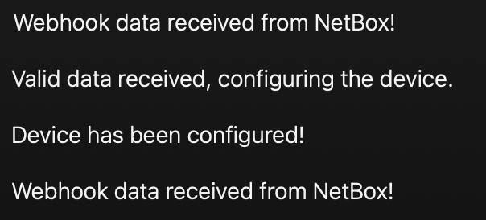

</td></tr>
<tr><td>5.</td><td>

*Optional* - a script named `show_interface_config.py` has been created for you to view interface configuration in JSON format. If you wish to view the configuration of the interface, run the script with argument `-d` set to `c9300` and argument `-i` set to `GigabitEthernet1/0/2`. Review the output and check that the interface description matches what you typed, along with the ticket metadata.  

</td><td>

```bash
python show_interface_config.py -d c9300 -i GigabitEthernet1/0/2
```

<details>
<summary><strong> 💡 Step help (click to view) </strong></summary>

<pre>
{
    "Cisco-IOS-XE-native:GigabitEthernet": [
        {
            "name": "1/0/2",
            "description": <b>"Webhook function completed! ##ticket:1234##",</b>

[... output omitted ...]

</pre>

</details>
</td></tr>
</table>

## Check-list before continuing

Before continuing to the next step, you should have completed the following:

- [x] **You have configured a webhook in NetBox to trigger when interface data has been updated**
- [x] **You had added code to your Flask app to process the NetBox webhook data**
- [x] **You have changed the description of an interface in NetBox and confirmed that a NETCONF change was triggered**
- [x] **You have received messages in Webex indicating the status of your change**

<table>
<tr><th>Description</th><th>Screenshot / code snippet</th></tr>

<tr><td>

**If you did not manage to complete all the steps in this task, run the following script in the Visual Studio Code terminal before continuing to the next task.**

</td><td>

```bash
sh netbox/complete_lab.sh
```

</td></tr>
</table>


<p align="center">
<a href="./2.md"></a>
<a href="./4.md"></a>
</p>


