[Helper files](../help/README.md) | [Back to the cover page](./README.md)


# 4. Add an event: ITSM / Ticket System Integration

> **In this task you will**
> - Configure a ticketing system to send a webhook when a network change ticket is created.
> - Create an interactive approval workflow with Webex Cards.
> - Update NetBox with data from the change request.
> - Close the change ticket if the NETCONF change was successful.
> - Verify that the network device configuration was changed.

| Task | Name | Status |
| - | - | - |
| 1. | [Setup for your events: YANG models and NETCONF for configuration change](1.md) | ✅ |
| 2. | [Add an event: Webex bot and Webex Webhook](2.md) | ✅ |
| 3. | [Add an event: NetBox for source of truth](3.md) | ✅ |
| 4. | **Add an event: Ticket system** | ⬅️ |


**Final flow:**

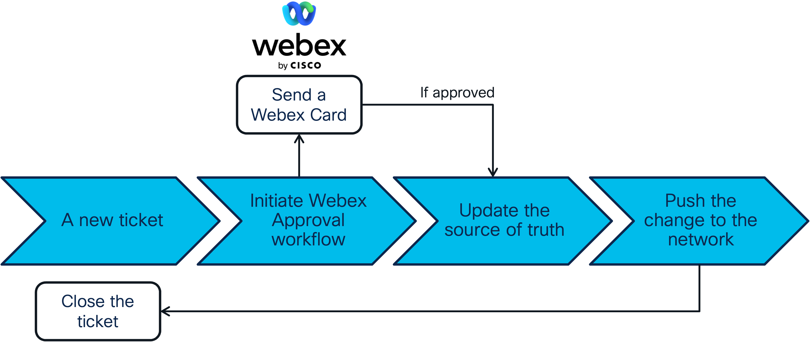


## 4.1 ITSM Integration

IT Service Management (ITSM) is a common workflow in many organizations that involves task prioritization and visibility based on submitted requests, often called *tickets*. One type of request that you are probably familiar with is a network change request.

Each organization has a different process, but one process that is frequently implemented includes some (or all) of the following steps:

1. Network engineer identifies a change that must be performed.
2. The engineer creates a change ticket with the details of the proposed change(s).
3. Minor changes might be immediately approved, while major changes might require a Change Approval Board.
4. After approval, the change is applied.
5. After the change is applied and verified, a comment is made in the ticket and the ticket is closed.

In this task, you will be automating much of this workflow - including the approval process!

While the ticketing system used in this lab might be different from the one you use every day, the concepts you learn here translate to most modern ITSM systems.

### 4.1.1 Configure the ticket system

In the following steps, you will configure the ticketing system to generate a webhook when a new network change ticket is created. The webhook destination has been preconfigured, but you must instruct the system *when* to generate a webhook. This is called a **trigger**.

>**Note**: Many ITSM systems require you to create triggers separate from the webhook definitions. This allows a single webhook to be used for different actions and workflows.

**STEPS:**

<table>

<tr><th>Step</th><th width=50%>Description</th><th>Screenshot / code snippet</th></tr>

<tr><td>1.</td><td>

Run the `tickets/get-ticket-details.sh` script in the Visual Studio Code terminal and copy the ticket system URL that is displayed to the clipboard.

</td><td>

```bash
sh tickets/get-ticket-details.sh
```

<details>
<summary><strong> 💡 Example output (click to view) </strong></summary>

```text
$ sh tickets/get-ticket-details.sh

Ticket System Access Details:

Ticket System URL:       https://tickets-url.example.com:1234
Ticket System Username:  tickets_username
Ticket System Password:  tickets_password

```
</details>
</td></tr>
<tr><td>2.</td><td>

Open a new tab in the browser and paste the ticket system URL. Click **Log In** in the top right and use the credentials from step 1 to login.

</td><td>

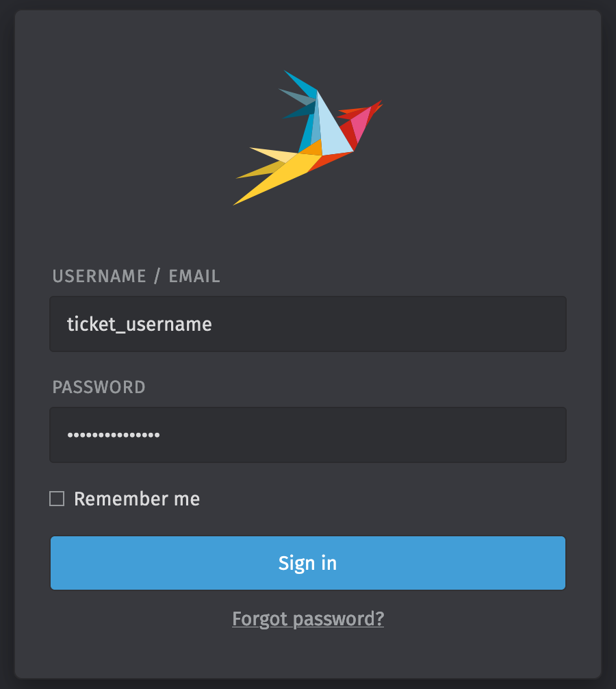

</td></tr>
<tr><td>3.</td><td>

You will be presented with a dashboard. No tickets have been created as this is a newly-configured system.

</td><td>

</td></tr>
<tr><td>4.</td><td>

Click the gear in the bottom of the left navigation menu to open system settings.

</td><td>


</td></tr>
<tr><td>5.</td><td>

In the settings menu, click `Trigger`

</td><td>

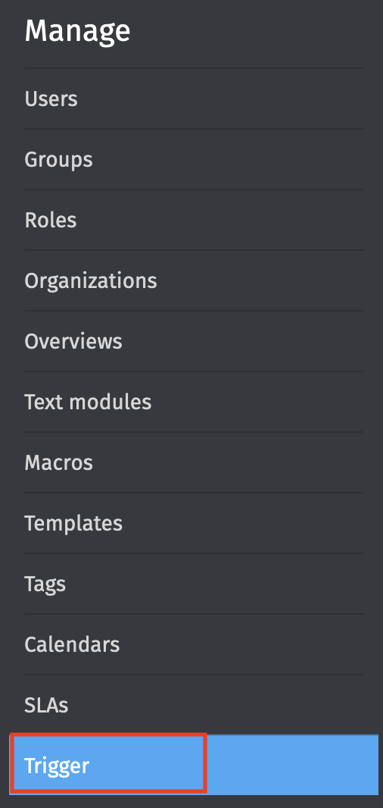

</td></tr>
<tr><td>6.</td><td>

You will be presented with the existing triggers, all of which have been disabled. Click `New Trigger` in the top right side of the page to create a new trigger.

</td><td>

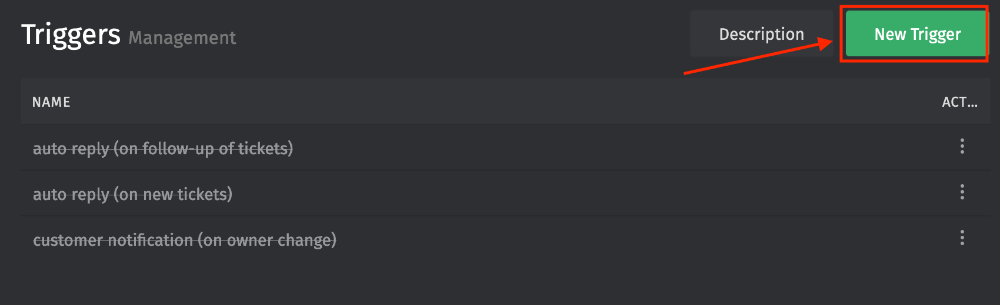

</td></tr>
<tr><td>7.</td><td>

Create the trigger. Give your trigger a name, such as `network change trigger`. Under "CONDITIONS," click `open` for the state. In the "EXECUTE CHANGES ON OBJECTS", section, change the default from `State` to `Webhook`. Select `network-change-webhook (http://apihost:12345/ticket)` as the webhook to trigger. Click `Submit` when your trigger matches the output in the step help.

</td><td>

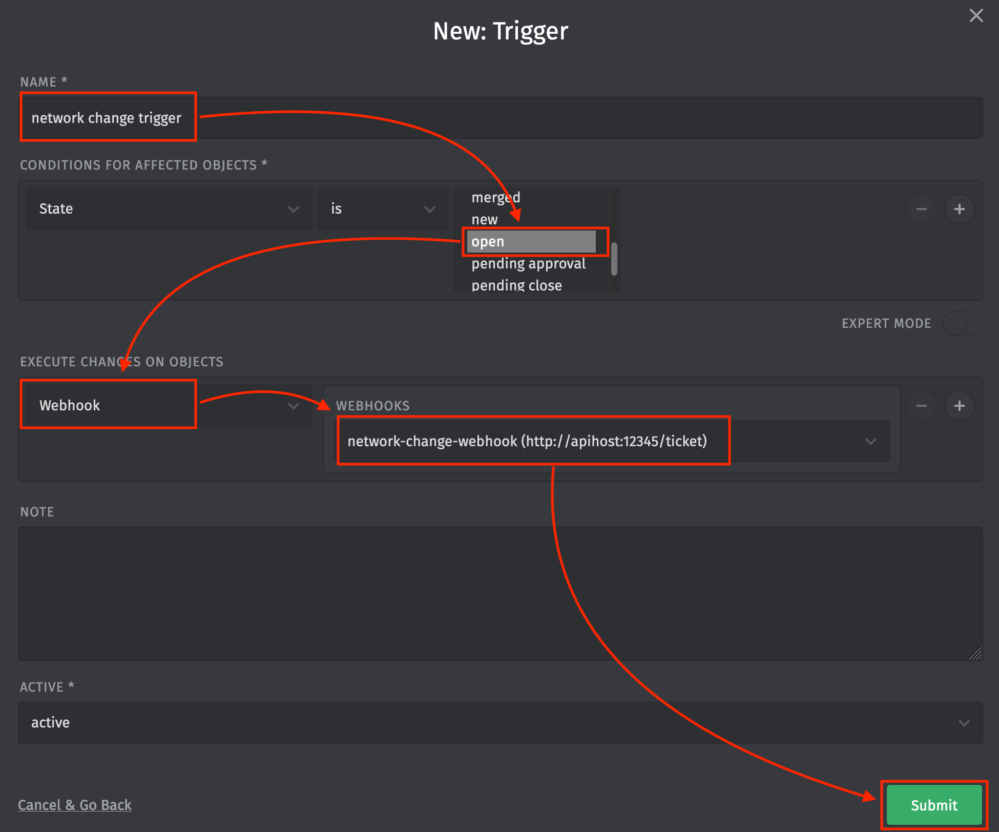

</td></tr>
<tr><td>8.</td><td>

You will return to the list of triggers. Your new trigger should appear in the list.

</td><td>

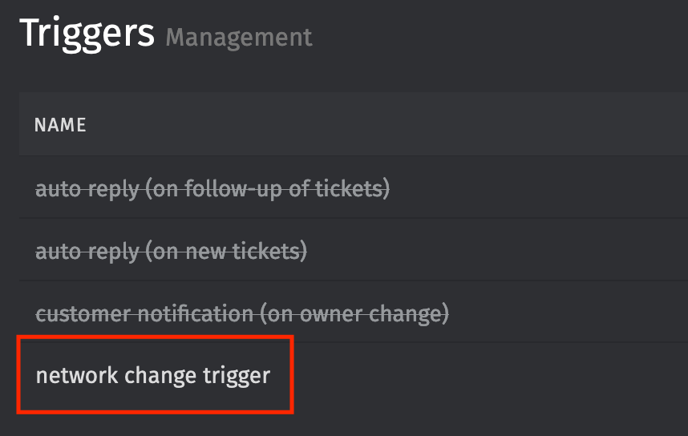

</td></tr>
<tr><td>9.</td><td>

In Visual Studio Code, ensure the Flask app is still running in the second terminal. If Flask is not running, start the app.

</td><td>

Do the following only if Flask is not running anymore!

```bash
flask --app main.py --debug run -p 12345 --host 0.0.0.0
```

</td></tr>
<tr><td>10.</td><td>

Return to the ticket system in your browser. Click the `+` link at the bottom of the left menu bar to create a new ticket.

</td><td>


</td></tr>
<tr><td>11.</td><td>

In the right menu, select the template named `Network Device Change` and click `APPLY`. This will pre-populate a network change ticket with fields to configure an interface.

</td><td>

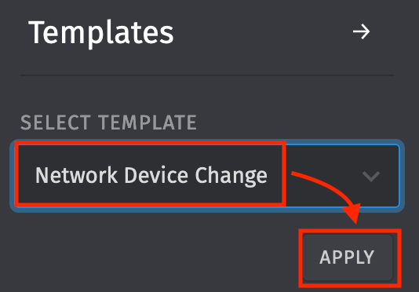

</td></tr>
<tr><td>12.</td><td>

In the change ticket window that appears, select an interface to configure such as GigabitEthernet1/0/2. You have not created any logic to handle the webhook in the Flask app yet, so no other setting is necessary at this time. Click `Create` at the bottom of the ticket when you are complete.

</td><td>

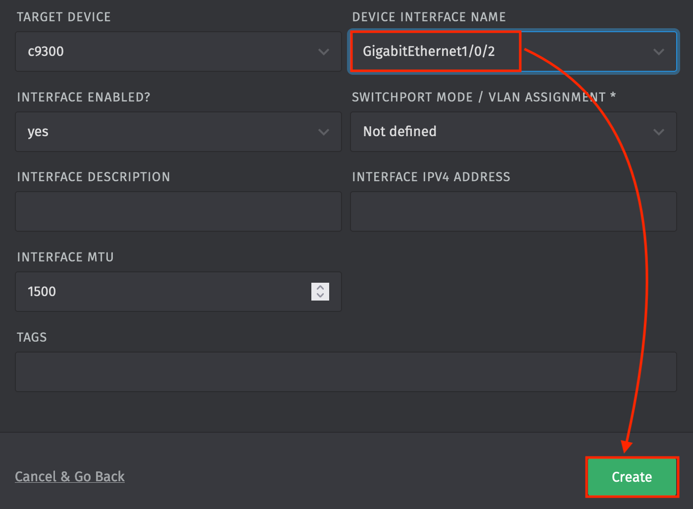

</td></tr>
<tr><td>13.</td><td>

Return to your Visual Studio Code terminal window. You should have received webhook data from the ticket system. Example output, formatted for easier reading, is listed in the step help.

</td><td>

<details>
<summary><strong> 💡 Example output (click to view) </strong></summary>

```
{
  'ticket': {
    'article_count': 1,
    'article_ids': [
      248
    ],
    'close_at': None,
    'close_diff_in_min': None,
    'close_escalation_at': None,
    'close_in_min': None,
    'create_article_sender': 'Customer',
    'create_article_sender_id': 2,
    'create_article_type': 'phone',
    'create_article_type_id': 5,
    'created_at': '2023-05-30T14:03:48.799Z',
    'created_by': {
      'active': True,
      'address': None,
      'city': '',
      'country': '',
      'created_at': '2023-05-27T16:24:42.257Z',
      'created_by': '-',
      'created_by_id': 1,
      'department': None,
      'email': 'developer@local.lab',
      'fax': '',
      'firstname': 'NetDevOps',
      'id': 3,
      'image': None,
      'image_source': None,
      'lastname': 'Developer',
      'login': 'developer',
      'mobile': '',
      'note': '',
      'organization': 'CLUS',
      'organization_id': 2,
      'organization_ids': [],
      'organizations': [],
      'out_of_office': False,
      'out_of_office_end_at': None,
      'out_of_office_replacement_id': None,
      'out_of_office_start_at': None,
      'overview_sorting_ids': [],
      'overview_sortings': [],
      'phone': '',
      'role_ids': [
        1,
        2
      ],
      'roles': [
        'Admin',
        'Agent'
      ],
      'source': None,
      'street': '',
      'updated_at': '2023-05-30T13:20:44.681Z',
      'updated_by': '-',
      'updated_by_id': 1,
      'verified': True,
      'vip': False,
      'web': '',
      'zip': ''
    },
    'created_by_id': 3,
    'customer': {
      'active': True,
      'address': None,
      'city': '',
      'country': '',
      'created_at': '2023-05-27T16:24:43.554Z',
      'created_by': 'developer',
      'created_by_id': 3,
      'department': None,
      'email': 'network-team@local.lab',
      'fax': '',
      'firstname': 'Network',
      'id': 4,
      'image': None,
      'image_source': None,
      'lastname': 'Team',
      'login': 'network-team@local.lab',
      'mobile': '',
      'note': '',
      'organization': 'CLUS',
      'organization_id': 2,
      'organization_ids': [],
      'organizations': [],
      'out_of_office': False,
      'out_of_office_end_at': None,
      'out_of_office_replacement_id': None,
      'out_of_office_start_at': None,
      'overview_sorting_ids': [],
      'overview_sortings': [],
      'phone': '',
      'role_ids': [
        3
      ],
      'roles': [
        'Customer'
      ],
      'source': None,
      'street': '',
      'updated_at': '2023-05-30T14:03:50.955Z',
      'updated_by': 'developer',
      'updated_by_id': 3,
      'verified': False,
      'vip': False,
      'web': '',
      'zip': ''
    },
    'customer_id': 4,
    'escalation_at': None,
    'first_response_at': None,
    'first_response_diff_in_min': None,
    'first_response_escalation_at': None,
    'first_response_in_min': None,
    'group': {
      'active': True,
      'assignment_timeout': None,
      'created_at': '2023-05-27T16:24:43.592Z',
      'created_by': 'developer',
      'created_by_id': 3,
      'email_address_id': None,
      'follow_up_assignment': True,
      'follow_up_possible': 'yes',
      'id': 2,
      'name': 'NetDevOps',
      'note': None,
      'reopen_time_in_days': None,
      'shared_drafts': True,
      'signature_id': None,
      'updated_at': '2023-05-27T16:24:43.614Z',
      'updated_by': 'developer',
      'updated_by_id': 3,
      'user_ids': [
        3
      ],
      'users': [
        'developer'
      ]
    },
    'group_id': 2,
    'id': 4,
    'last_close_at': None,
    'last_contact_agent_at': None,
    'last_contact_at': '2023-05-30T14:03:48.956Z',
    'last_contact_customer_at': '2023-05-30T14:03:48.956Z',
    'last_owner_update_at': None,
    'network_device_name': 'c9300',
    'network_interface_description': '',
    'network_interface_enabled': True,
    'network_interface_ip4_address': '',
    'network_interface_mtu': 1500,
    'network_interface_name': 'GigabitEthernet1/0/2',
    'network_switchport_mode_and_vlan': '::',
    'note': None,
    'number': '15004',
    'organization': {
      'active': True,
      'created_at': '2023-05-27T16:24:42.090Z',
      'created_by': '-',
      'created_by_id': 1,
      'domain': '',
      'domain_assignment': False,
      'id': 2,
      'member_ids': [
        4,
        3
      ],
      'members': [
        'network-team@local.lab',
        'developer'
      ],
      'name': 'CLUS',
      'note': '',
      'secondary_member_ids': [],
      'shared': True,
      'updated_at': '2023-05-30T14:03:48.927Z',
      'updated_by': '-',
      'updated_by_id': 1
    },
    'organization_id': 2,
    'owner': {
      'active': False,
      'address': '',
      'city': '',
      'country': '',
      'created_at': '2023-05-27T16:22:30.339Z',
      'created_by': '-',
      'created_by_id': 1,
      'department': '',
      'email': '',
      'fax': '',
      'firstname': '-',
      'id': 1,
      'image': None,
      'image_source': None,
      'lastname': '',
      'login': '-',
      'mobile': '',
      'note': '',
      'organization_id': None,
      'organization_ids': [],
      'organizations': [],
      'out_of_office': False,
      'out_of_office_end_at': None,
      'out_of_office_replacement_id': None,
      'out_of_office_start_at': None,
      'overview_sorting_ids': [],
      'overview_sortings': [],
      'phone': '',
      'role_ids': [],
      'roles': [],
      'source': None,
      'street': '',
      'updated_at': '2023-05-27T16:22:30.339Z',
      'updated_by': '-',
      'updated_by_id': 1,
      'verified': False,
      'vip': False,
      'web': '',
      'zip': ''
    },
    'owner_id': 1,
    'pending_time': None,
    'preferences': {},
    'priority': {
      'active': True,
      'created_at': '2023-05-27T16:22:30.780Z',
      'created_by': '-',
      'created_by_id': 1,
      'default_create': True,
      'id': 2,
      'name': '2 normal',
      'note': None,
      'ui_color': None,
      'ui_icon': None,
      'updated_at': '2023-05-27T16:22:30.780Z',
      'updated_by': '-',
      'updated_by_id': 1
    },
    'priority_id': 2,
    'state': 'open',
    'state_id': 2,
    'ticket_time_accounting': [],
    'ticket_time_accounting_ids': [],
    'ticket_type': 'network_change',
    'time_unit': None,
    'title': 'Network Change Request: Update Device Interface',
    'type': None,
    'update_diff_in_min': None,
    'update_escalation_at': None,
    'update_in_min': None,
    'updated_at': '2023-05-30T14:03:49.004Z',
    'updated_by': {
      'active': True,
      'address': None,
      'city': '',
      'country': '',
      'created_at': '2023-05-27T16:24:42.257Z',
      'created_by': '-',
      'created_by_id': 1,
      'department': None,
      'email': 'developer@local.lab',
      'fax': '',
      'firstname': 'NetDevOps',
      'id': 3,
      'image': None,
      'image_source': None,
      'lastname': 'Developer',
      'login': 'developer',
      'mobile': '',
      'note': '',
      'organization': 'CLUS',
      'organization_id': 2,
      'organization_ids': [],
      'organizations': [],
      'out_of_office': False,
      'out_of_office_end_at': None,
      'out_of_office_replacement_id': None,
      'out_of_office_start_at': None,
      'overview_sorting_ids': [],
      'overview_sortings': [],
      'phone': '',
      'role_ids': [
        1,
        2
      ],
      'roles': [
        'Admin',
        'Agent'
      ],
      'source': None,
      'street': '',
      'updated_at': '2023-05-30T13:20:44.681Z',
      'updated_by': '-',
      'updated_by_id': 1,
      'verified': True,
      'vip': False,
      'web': '',
      'zip': ''
    },
    'updated_by_id': 3
  },
  'article': {
    'attachments': [],
    'body': '<div>Network change ticket:</div><div><br></div><div>Update the device and interface defined below<br>\n</div>',
    'cc': None,
    'content_type': 'text/html',
    'created_at': '2023-05-30T14:03:48.956Z',
    'created_by': {
      'active': True,
      'address': None,
      'city': '',
      'country': '',
      'created_at': '2023-05-27T16:24:42.257Z',
      'created_by': '-',
      'created_by_id': 1,
      'department': None,
      'email': 'developer@local.lab',
      'fax': '',
      'firstname': 'NetDevOps',
      'id': 3,
      'image': None,
      'image_source': None,
      'lastname': 'Developer',
      'login': 'developer',
      'mobile': '',
      'note': '',
      'organization': 'CLUS',
      'organization_id': 2,
      'organization_ids': [],
      'organizations': [],
      'out_of_office': False,
      'out_of_office_end_at': None,
      'out_of_office_replacement_id': None,
      'out_of_office_start_at': None,
      'overview_sorting_ids': [],
      'overview_sortings': [],
      'phone': '',
      'role_ids': [
        1,
        2
      ],
      'roles': [
        'Admin',
        'Agent'
      ],
      'source': None,
      'street': '',
      'updated_at': '2023-05-30T13:20:44.681Z',
      'updated_by': '-',
      'updated_by_id': 1,
      'verified': True,
      'vip': False,
      'web': '',
      'zip': ''
    },
    'created_by_id': 3,
    'from': 'NetDevOps Developer',
    'id': 248,
    'in_reply_to': None,
    'internal': False,
    'message_id': None,
    'message_id_md5': None,
    'origin_by_id': None,
    'preferences': {},
    'references': None,
    'reply_to': None,
    'sender': 'Customer',
    'sender_id': 2,
    'subject': None,
    'ticket_id': 4,
    'to': 'NetDevOps',
    'type': 'phone',
    'type_id': 5,
    'updated_at': '2023-05-30T14:03:48.956Z',
    'updated_by': {
      'active': True,
      'address': None,
      'city': '',
      'country': '',
      'created_at': '2023-05-27T16:24:42.257Z',
      'created_by': '-',
      'created_by_id': 1,
      'department': None,
      'email': 'developer@local.lab',
      'fax': '',
      'firstname': 'NetDevOps',
      'id': 3,
      'image': None,
      'image_source': None,
      'lastname': 'Developer',
      'login': 'developer',
      'mobile': '',
      'note': '',
      'organization': 'CLUS',
      'organization_id': 2,
      'organization_ids': [],
      'organizations': [],
      'out_of_office': False,
      'out_of_office_end_at': None,
      'out_of_office_replacement_id': None,
      'out_of_office_start_at': None,
      'overview_sorting_ids': [],
      'overview_sortings': [],
      'phone': '',
      'role_ids': [
        1,
        2
      ],
      'roles': [
        'Admin',
        'Agent'
      ],
      'source': None,
      'street': '',
      'updated_at': '2023-05-30T13:20:44.681Z',
      'updated_by': '-',
      'updated_by_id': 1,
      'verified': True,
      'vip': False,
      'web': '',
      'zip': ''
    },
    'updated_by_id': 3,
    'accounted_time': 0.0
  }
}

```
</details>
</td></tr>
</table>

## 4.2 Webex Approval Workflow

To have a an option in the workflow to approve or decline the automated changes, you will process the webhook data generated by the ticket system and build a Webex **card**. Webex cards are based on the Adaptive Card standard and more information is available in the [Webex developer documentation](https://developer.webex.com/docs/buttons-and-cards).

Cards allow you to generate a graphical representation of data along with buttons that can be configured to submit data when clicked. For your ticket approval workflow, you will generate a card with the change details and give the option to approve or decline the change. When either the approve or decline button is pressed, Webex will generate another webhook that contains data from the card. 

### 4.2.1 Create the Webex card webhook

A card action is a different event than message creation, which means that the webhook created in Task 2 won't capture a card action. For this another Webex webhook needs to be created - the process for this is exactly the same as you did with `messages` but using `attachmentActions` event instead. To save you some time to focus on the overall workflow, a script has been created that automates the creation of this webhook. Note that this script reads your bot's token from the same credentials file used in Task 2.

**STEPS:**

<table>

<tr><th>Step</th><th width=50%>Description</th><th>Screenshot / code snippet</th></tr>
<tr><td>1.</td><td>

Run the script `tickets/setup_webhook_for_task_4.py`. If the script asks, provide your pod number.

> **Note**: The script will read the `webex/config.py` for your bot token. If you have not filled the token in task 2, the webhook setup script will fail.

</td><td>

```bash
python tickets/setup_webhook_for_task_4.py
```

</td></tr>
  </table>

### 4.2.2 Process the data received by the ticket webhook

In the following steps, you will update the Flask app to process data from the ticket webhook and send a Webex card with the change details.

**STEPS:**

<table>

<tr><th>Step</th><th width=50%>Description</th><th>Screenshot / code snippet</th></tr>

<tr><td>1.</td><td>

Open the `main.py` file in Visual Studio Code if not open already.

</td><td>

```bash
code main.py
```

</td></tr>
<tr><td>2.</td><td>

Locate the function that handles incoming `POST` data to the `/ticket` endpoint. It should look similar to how the `/netbox` and `/webex` endpoints looked in the beginning of those tasks.

</td><td>

```python
@app.route("/ticket", methods=["POST"])
def ticket_webhook():
    '''Function to be used with the ticketing system webhook'''

    event = request.json
    print(event)
    
    return "Received ticket event!"

```

</td></tr>
<tr><td>3.</td><td>

Below the `print` statement, create a variable named `webhook_details` that stores the value of `event.get("ticket", {})`. Create a second variable named `ticket_id` that stores the value of `webhook_details.get("id")` and one more variable named `ticket_number` to store the value of `webhook_details.get("number")`

>**Note**: The value of `ticket_id` is different from the ticket number. The `ticket_id` is the internal database ID of the received ticket, while the ticket number is the human-friendly number that we commonly see in ticketing systems. The database ID is how the Python API will interact with the ticket system, while `ticket_number` will be used to communicate the status of a ticket.

</td><td>
<details>
<summary><strong> 💡 Step help (click to view) </strong></summary>

```python
@app.route("/ticket", methods=["POST"])
def ticket_webhook():
    '''Function to be used with the ticketing system webhook'''

    event = request.json
    print(event)

    webhook_details = event.get("ticket", {})
    ticket_id = webhook_details.get("id")
    ticket_number = webhook_details.get("number")

    return "Received ticket event!"
```

</details>
</td></tr>
<tr><td>4.</td><td>

Below the `ticket_id` variable you just created, begin a `try..except..else` statement. In the `try` statement, create a new variable named `validated_data` to store the value of `netbox_card.validate_data(webhook_details)`.

</td><td>
<details>
<summary><strong> 💡 Step help (click to view) </strong></summary>

```python
@app.route("/ticket", methods=["POST"])
def ticket_webhook():
    '''Function to be used with the ticketing system webhook'''

    event = request.json
    print(event)

    webhook_details = event.get("ticket", {})
    ticket_id = webhook_details.get("id")
    ticket_number = webhook_details.get("number")

    try:
        validated_data = netbox_card.validate_data(webhook_details)

    return "Received ticket event!"
```

</details>
</td></tr>
<tr><td>5.</td><td>

Add the code to catch any raised `Exception` as `err`. If an exception is caught, send a Webex message stating that there is a problem validating the data and include the value of the `err` variable.

Also, update the ticket using the `tickets.update_ticket()` function. Pass the parameter `ticket_id`, a parameter named `comment` with a note similar to the text that you created for the Webex message, and set the parameter `state` to `attention required`. 

>**Note**: This will create a proper documentation trail of actions performed on the ticket, satisfying compliance requirements. Also, by changing the ticket state from "open" to "attention required", the ticket system will **not** send another webhook because the trigger will only send webhooks for tickets in the `open` state. 

</td><td>
<details>
<summary><strong> 💡 Step help (click to view) </strong></summary>

```python
@app.route("/ticket", methods=["POST"])
def ticket_webhook():
    '''Function to be used with the ticketing system webhook'''

    event = request.json
    print(event)

    webhook_details = event.get("ticket", {})
    ticket_id = webhook_details.get("id")
    ticket_number = webhook_details.get("number")

    try:
        validated_data = netbox_card.validate_data(webhook_details)
    except Exception as err:
        webex.send_message(webex.webex_token, webex.my_email,
                           f"There was a problem validating the data for ticket number {ticket_number}:\n{err}")
        tickets.update_ticket(ticket_id=ticket_id,
                              comment=f"There was a problem processing the ticket. Details:\n\n{err}",
                              state="attention required")

    return "Received ticket event!"
```

</details>
</td></tr>
<tr><td>6.</td><td>

To complete the `try..except..else` code, add an `else` statement. Add code to update the ticket with a `comment` stating that change is pending approval, and set the `state` to `pending approval`.

</td><td>
<details>
<summary><strong> 💡 Step help (click to view) </strong></summary>

```python
@app.route("/ticket", methods=["POST"])
def ticket_webhook():
    '''Function to be used with the ticketing system webhook'''

    event = request.json
    print(event)

    webhook_details = event.get("ticket", {})
    ticket_id = webhook_details.get("id")
    ticket_number = webhook_details.get("number")    

    try:
        validated_data = netbox_card.validate_data(webhook_details)
    except Exception as err:
        webex.send_message(webex.webex_token, webex.my_email,
                           f"There was a problem validating the data for ticket number {ticket_number}:\n{err}")
        tickets.update_ticket(ticket_id=ticket_id,
                              comment=f"There was a problem processing the ticket. Details:\n\n{err}",
                              state="attention required")
    else:
        tickets.update_ticket(ticket_id=ticket_id,
                              comment="Your change request has been received and is pending approval.",
                              state="pending approval")

    return "Received ticket event!"
```

</details>
</td></tr>
<tr><td>7.</td><td>

Prepare the text and data for the card. Inside the `else` statement after the last `tickets.update_ticket()` call, create a pair of variables on the same line: `card_text` and `card_metadata`. To set the contents of these variables, call the function `netbox_card.create_webex_card_data()` with the parameter `validated_data.dict()`

>**Note**: Functions can `return` more than one value. When a function is created that returns more than one value, the same number of variables must be created to receive the values generated by the function.

</td><td>
<details>
<summary><strong> 💡 Step help (click to view) </strong></summary>

```python
@app.route("/ticket", methods=["POST"])
def ticket_webhook():
    '''Function to be used with the ticketing system webhook'''

    event = request.json
    print(event)

    webhook_details = event.get("ticket", {})
    ticket_id = webhook_details.get("id")
    ticket_number = webhook_details.get("number")    

    try:
        validated_data = netbox_card.validate_data(webhook_details)
    except Exception as err:
        webex.send_message(webex.webex_token, webex.my_email,
                           f"There was a problem validating the data for ticket number {ticket_number}:\n{err}")
        tickets.update_ticket(ticket_id=ticket_id,
                              comment=f"There was a problem processing the ticket. Details:\n\n{err}",
                              state="attention required")
    else:
        tickets.update_ticket(ticket_id=ticket_id,
                              comment="Your change request has been received and is pending approval.",
                              state="pending approval")

        card_text, card_metadata = netbox_card.create_webex_card_data(validated_data.dict())
        
    return "Received ticket event!"
```

</details>
</td></tr>
<tr><td>8.</td><td>

Use the `netbox_card.send_netbox_card()` function to send a Webex card. A number of parameters are required. Use the information below to guide you:

- `token`: `webex.webex_token`
- `recipient_email`: `webex.my_email`
- `netbox_config`: `card_text`
- `meta_data`: `card_metadata`
- `template`: `./netbox_card/card.j2`
- `card_topic`: Enter text to be displayed at the top of the card. *Hint: You might want to include the `ticket_number`*
- `card_subtopic`: Enter text to highlight the purpose of the card
- `card_description`: Text that will be displayed to describe the details of the card

>**Note**: You might want to add different text to the `card_topic`, `card_subtopic`, and `card_description` fields so you can see how they affect the display of the card when it is sent.

</td><td>
<details>
<summary><strong> 💡 Step help (click to view) </strong></summary>

```python
@app.route("/ticket", methods=["POST"])
def ticket_webhook():
    '''Function to be used with the ticketing system webhook'''

    event = request.json
    print(event)

    webhook_details = event.get("ticket", {})
    ticket_id = webhook_details.get("id")
    ticket_number = webhook_details.get("number")    

    try:
        validated_data = netbox_card.validate_data(webhook_details)
    except Exception as err:
        webex.send_message(webex.webex_token, webex.my_email,
                           f"There was a problem validating the data for ticket number {ticket_number}:\n{err}")
        tickets.update_ticket(ticket_id=ticket_id,
                              comment=f"There was a problem processing the ticket. Details:\n\n{err}",
                              state="attention required")
    else:
        tickets.update_ticket(ticket_id=ticket_id,
                              comment="Your change request has been received and is pending approval.",
                              state="pending approval")

        card_text, card_metadata = netbox_card.create_webex_card_data(validated_data.dict())
        
        netbox_card.send_netbox_card(token=webex.webex_token,
                                     recipient_email=webex.my_email,
                                     netbox_config=card_text,
                                     meta_data=card_metadata,
                                     template="./netbox_card/card.j2",
                                     card_topic=f"Network change request {ticket_number}",
                                     card_subtopic=f"Request received to do some things",
                                     card_description="Here's some text to enter")

    return "Received ticket event!"
```

</details>
</td></tr>
</table>

### 4.2.3 Test the Webex card creation

Now that you have written some code to process the ticket data, it is time to test that the Webex card is send with a summary of change data.

**STEPS:**

<table>

<tr><th>Step</th><th width=50%>Description</th><th>Screenshot / code snippet</th></tr>
<tr><td>1.</td><td>

Return to the browser tab with the ticket system. You should see your network change ticket listed in the left menu bar. Click the ticket to show the details.

</td><td>

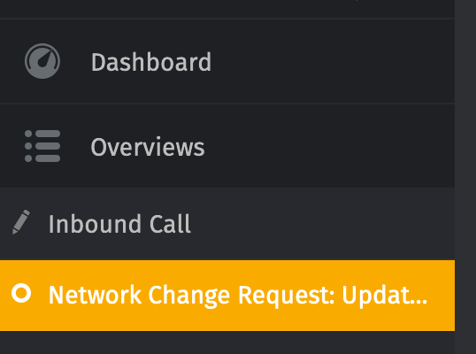

</td></tr>
<tr><td>2.</td><td>

Generate a new webhook by updating the `INTERFACE ENABLED?` field to `no` and then clicking `Update` at the bottom of the page to update the ticket.

>**Note**: Any field can be updated to generate a new webhook. The ticket system will only trigger a webhook if there was a change to the ticket, so you must change some field before clicking the `Update` button.

</td><td>

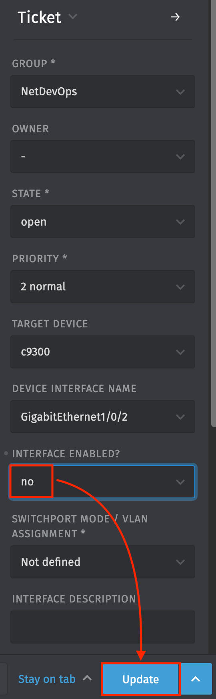


</td></tr>
<tr><td>3.</td><td>

Review your Flask console output. You should see output where the ticket webhook was processed and a message indicating that a Webex card was sent.

</td><td>
<details>
<summary><strong> 💡 Example output (click to view) </strong></summary>

```text
{'ticket': {'article_count': 1, 'article_ids': [280], 'close_at': None, 'close_diff_in_min': None, 'close_escalation_at': None, 'close_in_min': None, 'create_article_sender': 'Customer', 'create_article_sender_id': 2, 'create_article_type': 'phone', 'create_article_type_id': 5, 'created_at': '2023-05-30T16:15:11.515Z', 'created_by': {'active': True, 'address': None, 'city': '', 'country': '', 'created_at': '2023-05-27T16:24:42.257Z', 'created_by': '-', 'created_by_id': 1, 'department': None, 'email': 'developer@local.lab', 'fax': '', 'firstname': 'NetDevOps', 'id': 3, 'image': None, 'image_source': None, 'lastname': 'Developer', 'login': 'developer', 'mobile': '', 'note': '', 'organization': 'CLUS', 'organization_id': 2, 'organization_ids': [], 'organizations': [], 'out_of_office': False, 'out_of_office_end_at': None, 'out_of_office_replacement_id': None, 'out_of_office_start_at': None, 'overview_sorting_ids': [], 'overview_sortings': [], 'phone': '', 'role_ids': [1, 2], 'roles': ['Admin', 'Agent'], 'source': None, 'street': '', 'updated_at': '2023-05-30T16:25:03.946Z', 'updated_by': 'developer', 'updated_by_id': 3, 'verified': True, 'vip': False, 'web': '', 'zip': ''}, 'created_by_id': 3, 'customer': {'active': True, 'address': None, 'city': '', 'country': '', 'created_at': '2023-05-27T16:24:43.554Z', 'created_by': 'developer', 'created_by_id': 3, 'department': None, 'email': 'network-team@local.lab', 'fax': '', 'firstname': 'Network', 'id': 4, 'image': None, 'image_source': None, 'lastname': 'Team', 'login': 'network-team@local.lab', 'mobile': '', 'note': '', 'organization': 'CLUS', 'organization_id': 2, 'organization_ids': [], 'organizations': [], 'out_of_office': False, 'out_of_office_end_at': None, 'out_of_office_replacement_id': None, 'out_of_office_start_at': None, 'overview_sorting_ids': [], 'overview_sortings': [], 'phone': '', 'role_ids': [3], 'roles': ['Customer'], 'source': None, 'street': '', 'updated_at': '2023-05-30T16:15:13.205Z', 'updated_by': 'developer', 'updated_by_id': 3, 'verified': False, 'vip': False, 'web': '', 'zip': ''}, 'customer_id': 4, 'escalation_at': None, 'first_response_at': None, 'first_response_diff_in_min': None, 'first_response_escalation_at': None, 'first_response_in_min': None, 'group': {'active': True, 'assignment_timeout': None, 'created_at': '2023-05-27T16:24:43.592Z', 'created_by': 'developer', 'created_by_id': 3, 'email_address_id': None, 'follow_up_assignment': True, 'follow_up_possible': 'yes', 'id': 2, 'name': 'NetDevOps', 'note': None, 'reopen_time_in_days': None, 'shared_drafts': True, 'signature_id': None, 'updated_at': '2023-05-27T16:24:43.614Z', 'updated_by': 'developer', 'updated_by_id': 3, 'user_ids': [3], 'users': ['developer']}, 'group_id': 2, 'id': 12, 'last_close_at': None, 'last_contact_agent_at': None, 'last_contact_at': '2023-05-30T16:15:11.563Z', 'last_contact_customer_at': '2023-05-30T16:15:11.563Z', 'last_owner_update_at': '2023-05-30T16:30:05.453Z', 'network_device_name': 'c9300', 'network_interface_description': '', 'network_interface_enabled': False, 'network_interface_ip4_address': '', 'network_interface_mtu': 1500, 'network_interface_name': 'GigabitEthernet1/0/2', 'network_switchport_mode_and_vlan': '::', 'note': None, 'number': '15012', 'organization': {'active': True, 'created_at': '2023-05-27T16:24:42.090Z', 'created_by': '-', 'created_by_id': 1, 'domain': '', 'domain_assignment': False, 'id': 2, 'member_ids': [4, 3], 'members': ['network-team@local.lab', 'developer'], 'name': 'CLUS', 'note': '', 'secondary_member_ids': [], 'shared': True, 'updated_at': '2023-05-30T16:15:11.557Z', 'updated_by': '-', 'updated_by_id': 1}, 'organization_id': 2, 'owner': {'active': False, 'address': '', 'city': '', 'country': '', 'created_at': '2023-05-27T16:22:30.339Z', 'created_by': '-', 'created_by_id': 1, 'department': '', 'email': '', 'fax': '', 'firstname': '-', 'id': 1, 'image': None, 'image_source': None, 'lastname': '', 'login': '-', 'mobile': '', 'note': '', 'organization_id': None, 'organization_ids': [], 'organizations': [], 'out_of_office': False, 'out_of_office_end_at': None, 'out_of_office_replacement_id': None, 'out_of_office_start_at': None, 'overview_sorting_ids': [], 'overview_sortings': [], 'phone': '', 'role_ids': [], 'roles': [], 'source': None, 'street': '', 'updated_at': '2023-05-27T16:22:30.339Z', 'updated_by': '-', 'updated_by_id': 1, 'verified': False, 'vip': False, 'web': '', 'zip': ''}, 'owner_id': 1, 'pending_time': None, 'preferences': {}, 'priority': {'active': True, 'created_at': '2023-05-27T16:22:30.780Z', 'created_by': '-', 'created_by_id': 1, 'default_create': True, 'id': 2, 'name': '2 normal', 'note': None, 'ui_color': None, 'ui_icon': None, 'updated_at': '2023-05-27T16:22:30.780Z', 'updated_by': '-', 'updated_by_id': 1}, 'priority_id': 2, 'state': 'open', 'state_id': 2, 'ticket_time_accounting': [], 'ticket_time_accounting_ids': [], 'ticket_type': 'network_change', 'time_unit': None, 'title': 'Network Change Request: Update Device Interface', 'type': None, 'update_diff_in_min': None, 'update_escalation_at': None, 'update_in_min': None, 'updated_at': '2023-05-30T16:30:05.449Z', 'updated_by': {'active': True, 'address': None, 'city': '', 'country': '', 'created_at': '2023-05-27T16:24:42.257Z', 'created_by': '-', 'created_by_id': 1, 'department': None, 'email': 'developer@local.lab', 'fax': '', 'firstname': 'NetDevOps', 'id': 3, 'image': None, 'image_source': None, 'lastname': 'Developer', 'login': 'developer', 'mobile': '', 'note': '', 'organization': 'CLUS', 'organization_id': 2, 'organization_ids': [], 'organizations': [], 'out_of_office': False, 'out_of_office_end_at': None, 'out_of_office_replacement_id': None, 'out_of_office_start_at': None, 'overview_sorting_ids': [], 'overview_sortings': [], 'phone': '', 'role_ids': [1, 2], 'roles': ['Admin', 'Agent'], 'source': None, 'street': '', 'updated_at': '2023-05-30T16:25:03.946Z', 'updated_by': 'developer', 'updated_by_id': 3, 'verified': True, 'vip': False, 'web': '', 'zip': ''}, 'updated_by_id': 3}, 'article': {}}

Updating ticket with parameters: {'state': 'pending approval', 'article': {'body': 'Your change request has been received and is pending approval.', 'type': 'note', 'internal': False}}
Sending a card to psample@cisco.com
Status code of sending the Webex message: 200

```
</details>

</td></tr>
<tr><td>4.</td><td>

In the ticket system, notice that the ticket has been updated as follows:

- The state has changed from "open" to "pending approval"
- A new comment was added to the ticket stating that the change request was received and is pending approval

>**Note**: Automating ticket tasks can be very helpful to you as a network engineer. Adding comments to tickets when a workflow begins is an easy way to stop SLA timers! 

</td><td>

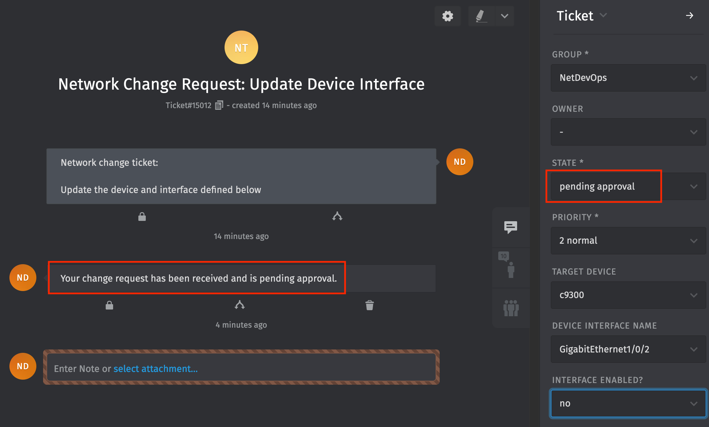

</td></tr>
<tr><td>5.</td><td>

Open Webex in your mobile app or on the lab workstation using the web GUI (web.webex.com) and navigate the 1:1 chat with your bot. You should now have a Webex card that shows the ticket details along with buttons to approve or decline the change.

</td><td>

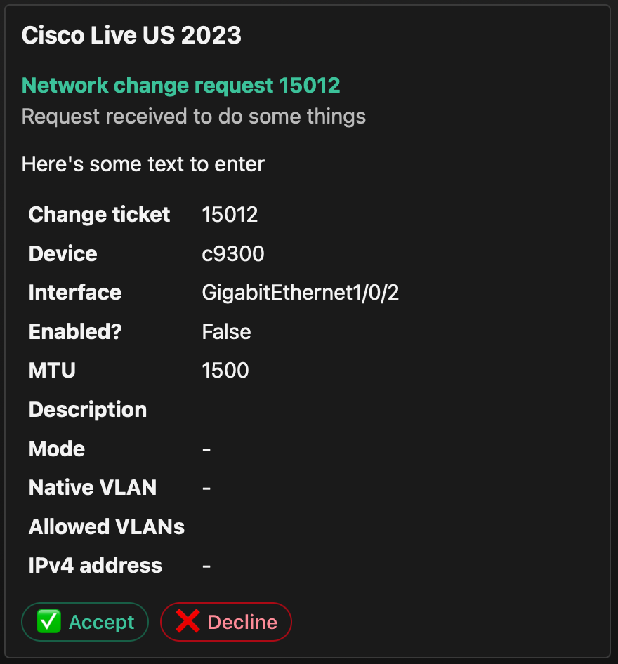

</td></tr>
<tr><td>6.</td><td>

Click the `Decline` button in the Webex card. After a short period, you should see the card get deleted along with a message indicating the change was declined.

</td><td>
<details>
<summary><strong> 💡 Example output (click to view) </strong></summary>

```text
Your action ❌ Decline has been recorded. The change will 🛑 not 🛑 be executed.

```

</details>
</td></tr>
<tr><td>7.</td><td>

Return to the ticket system in your browser. You should see that your change request now has a comment stating that the change was declined, and the ticket state should now be `denied`.

>**Note**: The code to process Webex card events has already been written for you. The focus on the remaining steps in this lab are to show what is possible with event-driven automation, and not to repeat writing the same type of code in your Flask app. All the code is available for your review if interested after the lab.

</td><td>

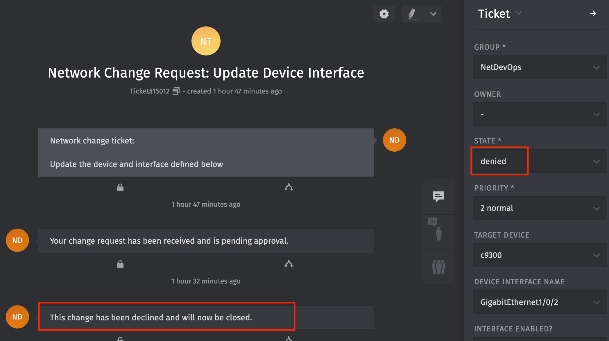

</td></tr>
</table>

### 4.3 Bring it all together!

You are nearing completion of your project, but it's time to see what is possible when your network configuration is **event-driven!**

In this task, you will change your device configuration using the following workflow:

1. Create a network change ticket. The change will request approval to modify various parameters for a specific interface. 
2. Approve the Webex card with the change details.
3. Observe output in the Flask console.
4. Verify the change ticket was commented appropriately and has been closed.
5. Verify that the interface settings in NetBox match the change ticket.
6. Verify the operational state of the interface matches the state in NetBox.

**STEPS:**

<table>

<tr><th>Step</th><th width=50%>Description</th><th>Screenshot / code snippet</th></tr>
<tr><td>1.</td><td>

Open the browser tab with the ticket system. Click the `+` link in the left navigation bar, select the `Network Device Change` template in the right menu, and click `Apply`

</td><td>

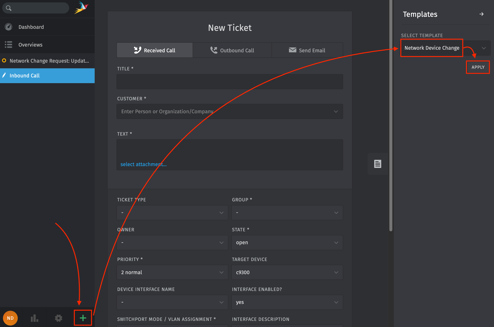

</td></tr>
<tr><td>2.</td><td>

Modify some interface parameters. In this example, the selected interface is `GigabitEthernet1/0/5`, the interface is `Enabled` and configured for `access` on VLAN `100: Wireless AP`. The description has been defined as `Configured from the ticket system!`, and the MTU is set to `2000`. When complete, click `Create`.

>**Note**: You can select any options you desire. This workflow is only an example!

</td><td>

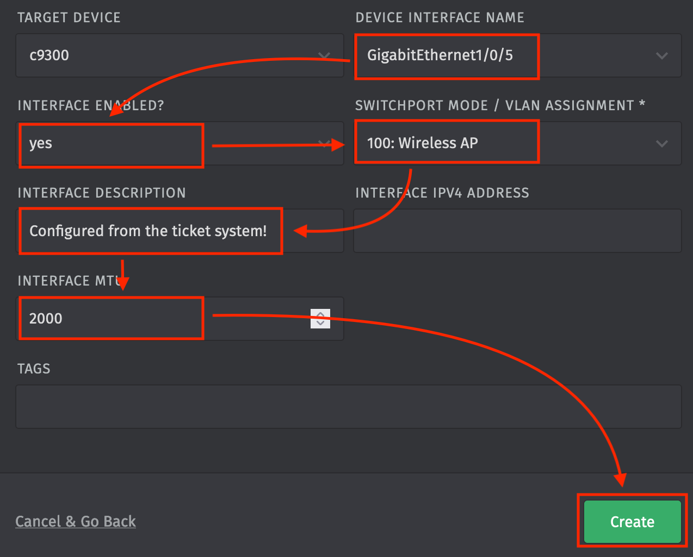

</td></tr>
<tr><td>3.</td><td>

Check your Webex bot space for an approval card. When it appears, click `Accept` to begin the network change.

</td><td>

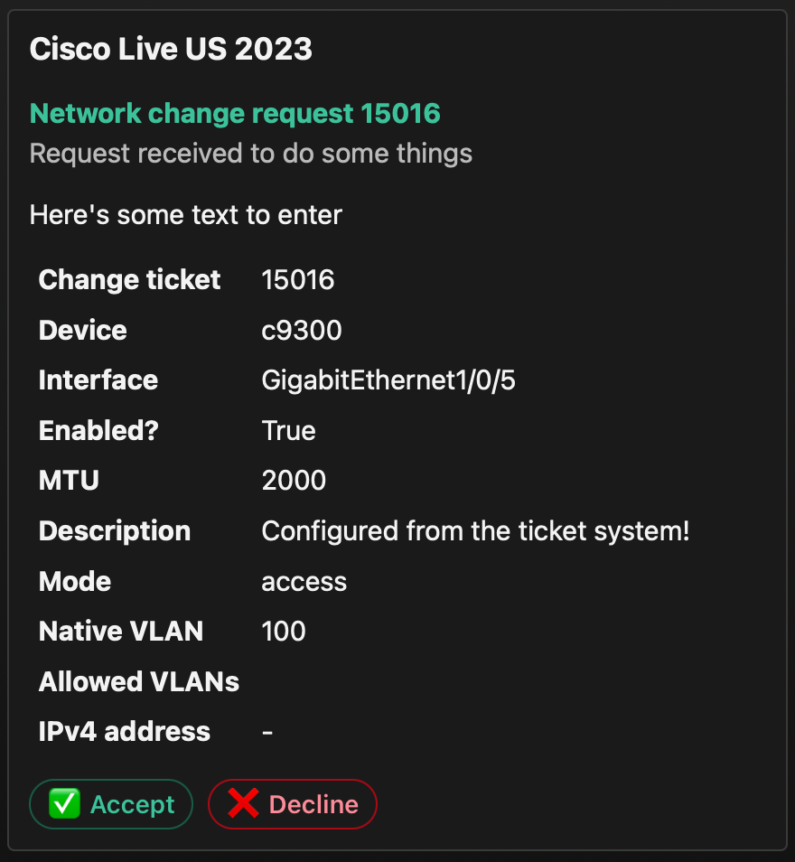

</td></tr>
<tr><td>4.</td><td>

Return the ticket system. If your change was successful, comments should be added to the ticket indicating that the change was successful and the ticket state should be `closed`. If attention is required, a message should inform you what to correct.

</td><td>

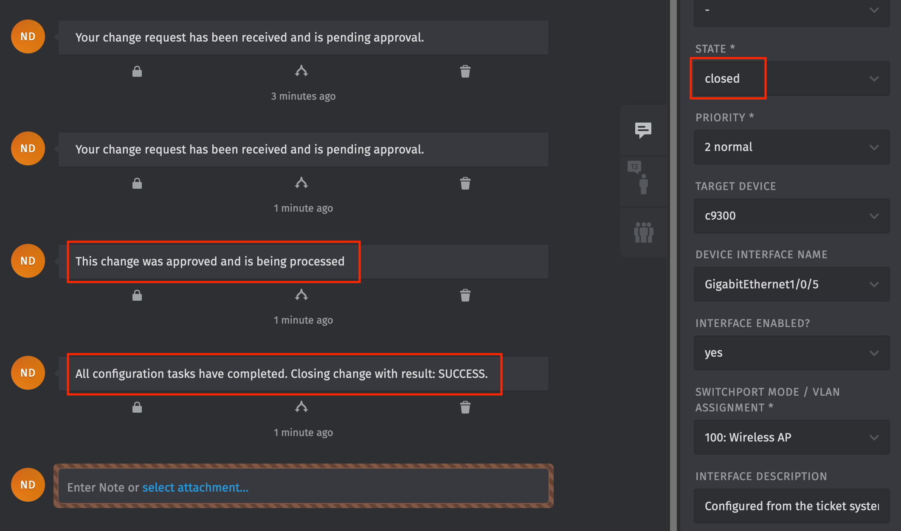

</td></tr>
<tr><td>5.</td><td>

In your browser, open the tab with the NetBox instance. Browse to the interface you configured in the previous step (`GigabitEthernet1/0/5` in the example).

</td><td>

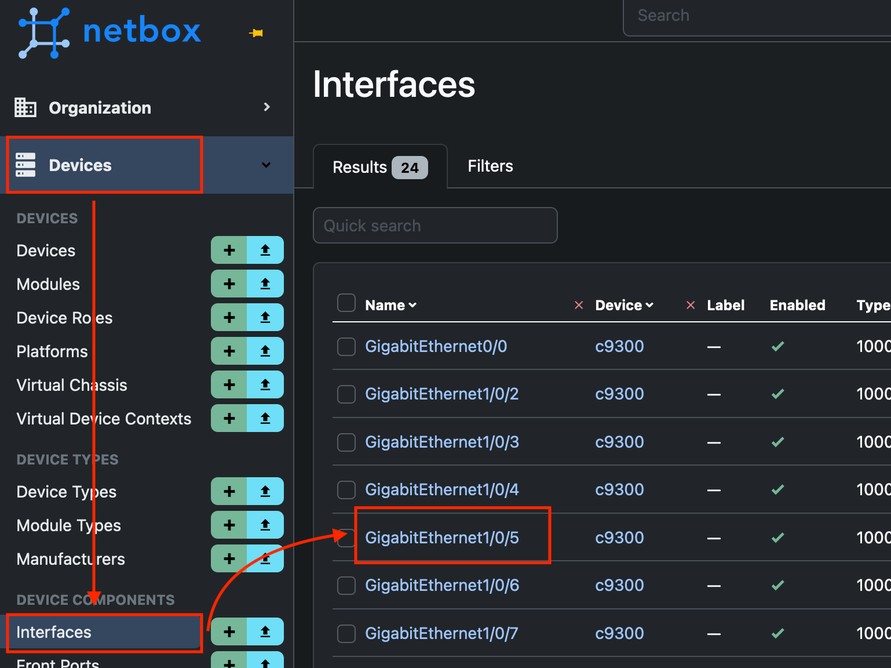

</td></tr>
<tr><td>6.</td><td>

Review the interface settings in NetBox. They should match the information you provided in the last approved change ticket.

</td><td>

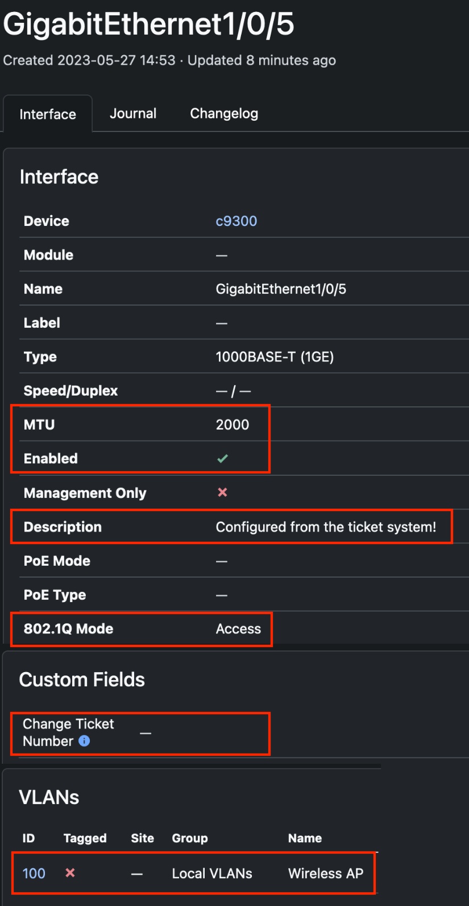

</td></tr>
<tr><td>7.</td><td>

Retrieve the interface configuration using the `show_interface_configuration.py` script. Supply the following arguments on the command line: `-d` with value `c9300` and `-i` with the name of the interface you changed in the ticket. For example: `-i GigabitEthernet1/0/5`

>**Note**: There is a script available for you to retrieve JSON-formatted data from a device interface using RESTCONF. The script was copied to your code directory when you initialized the lab.

</td><td>

```bash
python show_interface_config.py -d c9300 -i GigabitEthernet1/0/5
```

</td></tr>
<tr><td>8.</td><td>

Review the JSON output. Pay attention to the values you expect to change. For example, description, MTU, switchport mode, access VLAN.

</td><td>

<details>
<summary><strong> 💡 Example output (click to view) </strong></summary>

<pre>
{
    "Cisco-IOS-XE-native:GigabitEthernet": [
        {
            "name": "1/0/5",
            <strong>"description": "Configured from the ticket system! ##ticket:15016##",</strong>
            "switchport-conf": {
                <strong>"switchport": true</strong>
            },
            "switchport-config": {
                "<strong>switchport</strong>": {
                    "Cisco-IOS-XE-switch:<strong>access</strong>": {
                        "vlan": {
                            <strong>"vlan": 100</strong>
                        }
                    },
                    "Cisco-IOS-XE-switch:<strong>mode</strong>": {
                        <strong>"access": {}</strong>
                    }
                }
            },
            "<strong>switchport</strong>": {
                "Cisco-IOS-XE-switch:<strong>access</strong>": {
                    "vlan": {
                        <strong>"vlan": 100</strong>
                    }
                },
            <strong>"mtu": 2000,</strong>

[ ... output omitted ... ]

</pre>
</details>

</td></tr>
</table>


## Check-list before continuing

- [x] **You have created a trigger to instruct your ticket system to send a webhook.**
- [x] **You have tested that the webhook is functional.**
- [x] **You have processed webhook data from the ticket system and created a Webex card.**
- [x] **An action was performed on an approval/denial workflow.**
- [x] **NetBox data matches the approved change ticket data.**
- [x] **The device configuration matches the NetBox interface data.**

<table>
<tr><th>Description</th><th>Screenshot / code snippet</th></tr>

<tr><td>

**If you did not manage to complete all the steps in this task, run the following script in the Visual Studio Code terminal before continuing to the next task.**
</td><td>

```bash
sh tickets/complete_lab.sh
```

</td></tr>
</table>


<p align="center">
<a href="./3.md"></a>
<a href="./finish.md"></a>
</p>


