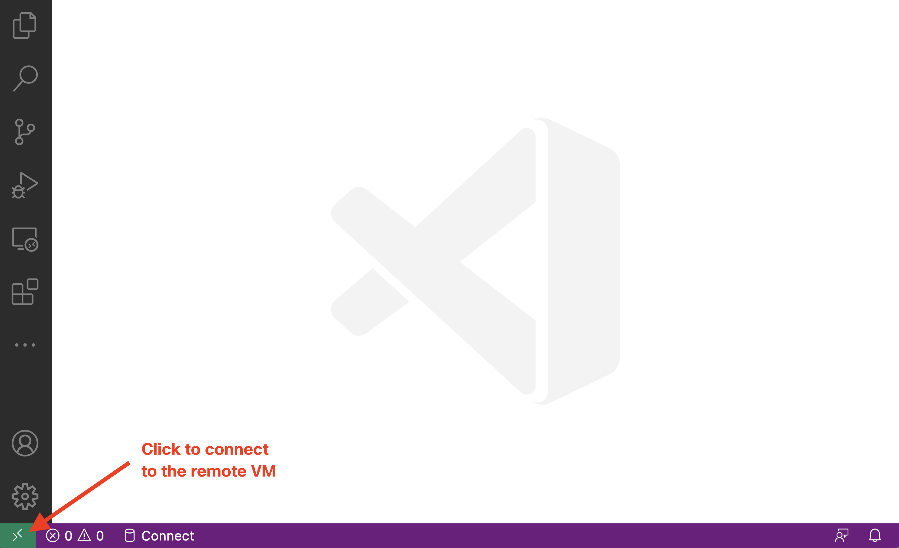
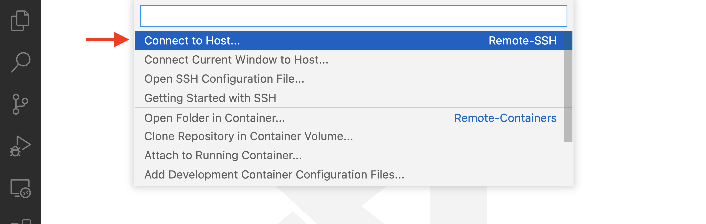
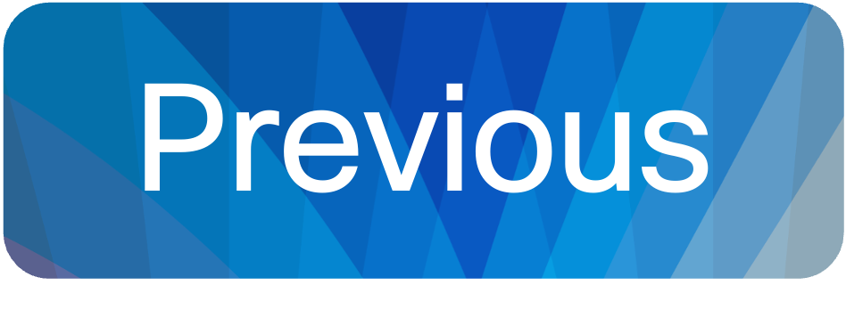
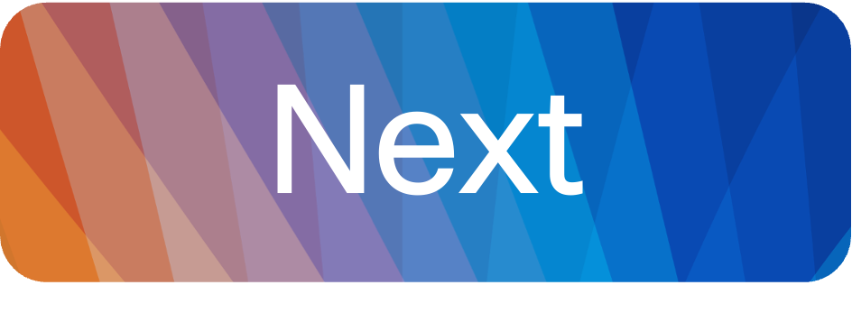

[Helper files](../help/README.md) | [Back to the cover page](./README.md)


# 0. Connect to the lab environment

During the Cisco Live event, each participant receives their own hardware Pod. Each pod includes a Linux development host, YANG Suite, a running NetBox instance, and a ticket system.


## Connect to your environment using Visual Studio Code remote SSH extension

> **Note**: Instructor will provide you with your Pod number and credentials.

**STEPS:**

<table>

<tr><th>Step</th><th width=50%>Description</th><th>Screenshot / code snippet</th></tr>

<tr><td>1.</td><td>

Open the Microsoft Visual Studio Code application from your desktop.

</td><td>


</td></tr>

<tr><td>2.</td><td>

To connect to your Linux Developer VM, click the green icon on the left bottom of Visual Studio Code application.

</td><td>



</td></tr>

<tr><td>3.</td><td>

Select `Connect to Host...`.

</td><td>



</td></tr>
<tr><td>4.</td><td>
    
Fill in the connection details to your Pod's Developer VM: `auto@pod<xx>-xelab.cisco.com:3389` where `<xx>` should be replaced with a two digit number of your pod. For example Pod 50 would be `auto@pod50-xelab.cisco.com:3389`.

> **Note**: If your pod number is one digit, add a zero in front, for example Pod 1 number would be `01`.

> **Note**: If you are prompted to select the platform of the remote host, click `Linux`.

</td><td>


</td></tr>
<tr><td>5.</td><td>

If prompted to verify the Fingerprint, click `Continue`.

</td></tr>
<tr><td>6.</td><td>

Fill in the password that the instructor has provided you.


</td></tr>
<tr><td>7.</td><td>

After a short period of loading, Visual Studio code view will update to match the settings on the developer VM. Note how the terminal view on the bottom right now starts with the `(venv) auto@podXY-xelab:~$` - this is the Developer VM on which you will complete the Lab tasks. Note also that you can see on the bottom right the Pod URL to which you are connected to.

> **Note**: If the terminal view does not show up automatically, you can open it from the top menu of Visual Studio Code application: `Terminal` > `New terminal`
</td><td>


</td></tr>
</table>

## Run the setup script

**STEPS:**

<table>

<tr><th>Step</th><th width=50%>Description</th><th>Screenshot / code snippet</th></tr>

<tr><td>1.</td><td>

In the Microsoft Visual Studio Code terminal, change directory to
`~/ciscolive-ltrcrt-2005`

</td><td>

```bash
cd ~/ciscolive-ltrcrt-2005
```

</td></tr>
<tr><td>2.</td><td>

Inside the terminal, issue the command git pull to update the code for the
lab to the current version.

</td><td>

```bash
git pull
```

</td></tr>
<tr><td>3.</td><td>

In the terminal, use the `sh` command to execute the `prepare_lab.sh` script from the
`~/ciscolive-ltrcrt-2005/setup` directory.

> **Note**: This script makes sure that you have the right code in your pod, and verifies the connectivity to the resources that you will use during the lab.

</td><td>

```bash
sh ~/ciscolive-ltrcrt-2005/setup/prepare_lab.sh
```

<hr />


</td></tr>
<tr><td>4.</td><td>

Use the `cd` command to change to the working directory `~/event-lab`

</td><td>

```bash
cd ~/event-lab
```

</td></tr>
<tr><td>5.</td><td colspan=2>

You are ready to start the first lab activity! 

> **Note**: Every task expects you to be in the `~/event-lab` folder. All the code with which you are working is located in this folder.


</td></tr>
</table>


## Visual Studio Code tips

Throughout this lab, you will work in the Visual Studio Code terminal using the SSH extension that you set up in this preparation task.

- You can open a file from Visual Studio Code's terminal with the command `code`.
    ```bash
    code filename.py
    ```

- You can open multiple Visual Studio code terminals. This will be useful when you need to leave something running such as your Flask application, but still want to be able to run your other scripts separately.

    

## Check-list before continuing

Before continuing to the next step, you should have completed the following:

* [x] **Connected to your pod using Visual Studio Code remote SSH extension**
* [x] **Ran the setup script successfully**


<p align="center">
<a href="./README.md"></a>
<a href="./1.md"></a>
</p>


