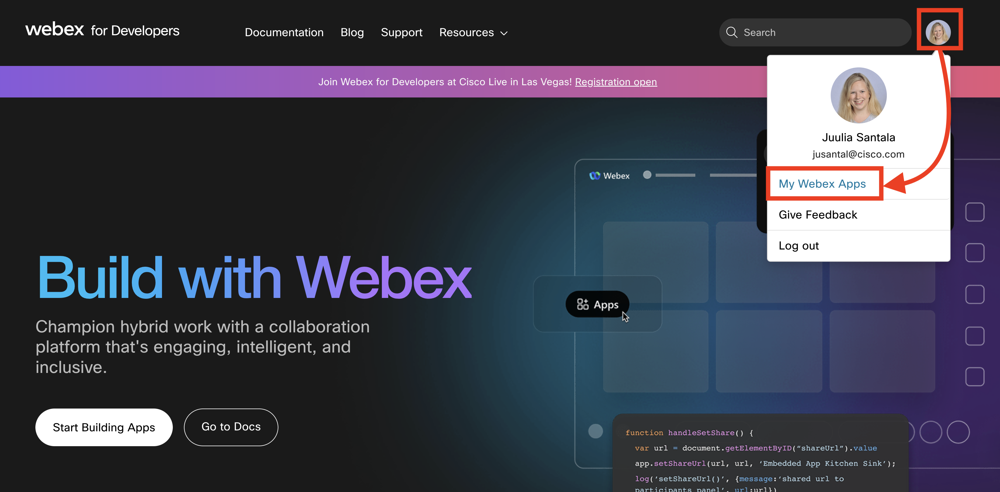
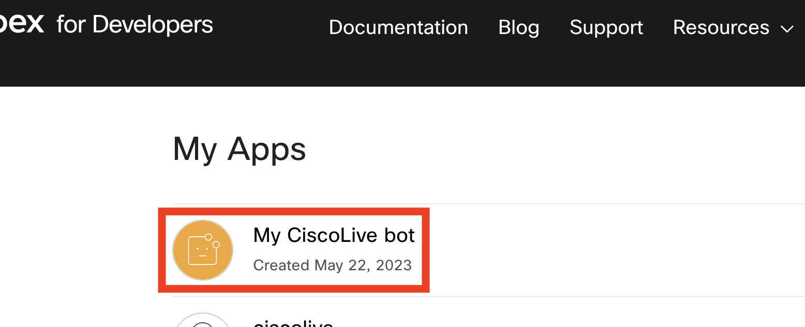
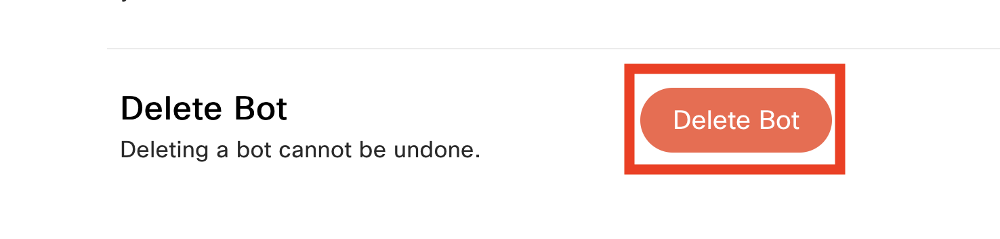

[Helper files](../help/README.md) | [Back to the cover page](./README.md)

# You made it! Good work :)

During this lab, you have learned the following:

- How to work with YANG suite to locate the correct YANG model and how to use NETCONF for configuration change
- How to use Webex bot both for sending alerts as well as receiving input through webhooks
- How to use different sources of truth such as NetBox
- How to interact with other system APIs such as ticketing systems
- How to build a FLASK application to tie the components together into an event driven automation workflow

The goal of this lab is to help you implement event driven automation in **your** environment. Take the code with you and start customizing it to fit to your use cases!

## Clean up

You have created in this lab a Bot under your own Webex account. As you have used the Bot's token in the lab and also linked it to the development environment through a webhook, it is recommended that you delete the bot from your account once you are done with the lab tasks. Deleting the bot is simple - just follow the couple of steps below.

**STEPS:**

<table>

<tr><th>Step</th><th width=50%>Description</th><th>Screenshot / code snippet</th></tr>

<tr><td>1.</td><td colspan=2>

Use the browser to navigate back to [developer.webex.com](https://developer.webex.com).

</td></tr>
<tr><td>2.</td><td>

Locate your Webex account's icon on the top right of the page. Click the icon and select `My Webex Apps`.

</td><td>

</td></tr>
<tr><td>3.</td><td>

You should now see the list of all of your Webex Apps. Click the name of your bot.

</td><td>

</td></tr>
<tr><td>4.</td><td>

Scroll to the very bottom of the page, where you can find the option to delete the bot. Click `Delete`.

> **Note**: You could also just `Regenerate Access Token` on the bot's page. If you decide to take this route and continue using the bot you created, make sure to remove the webhooks that report your bot's activity to the lab network.

</td><td>

</td></tr>
</table>

