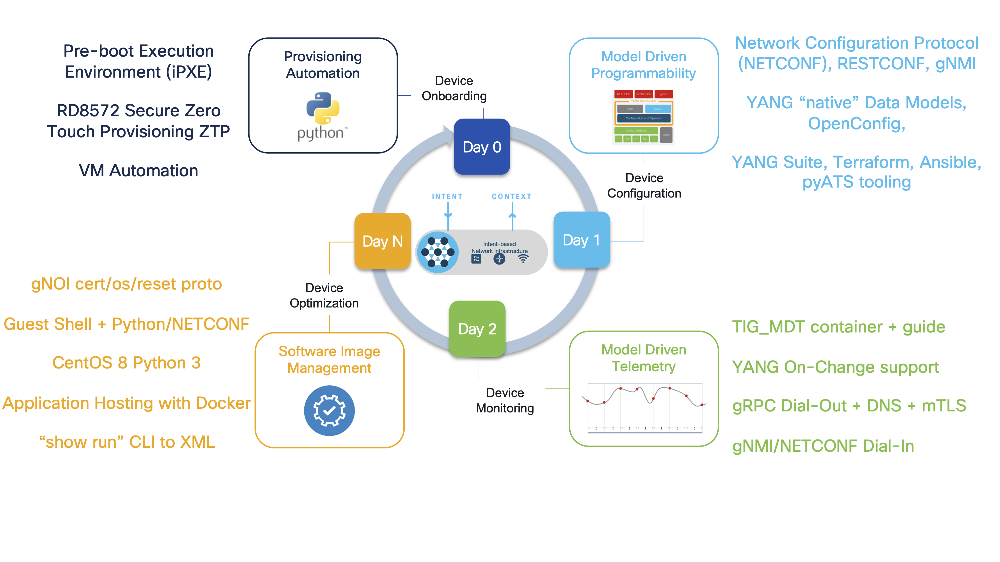
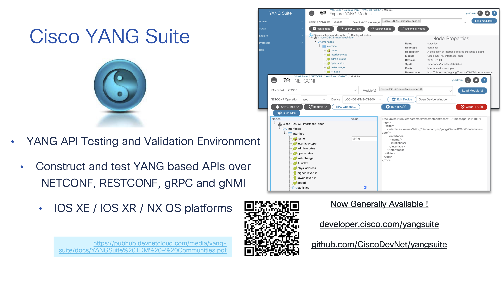
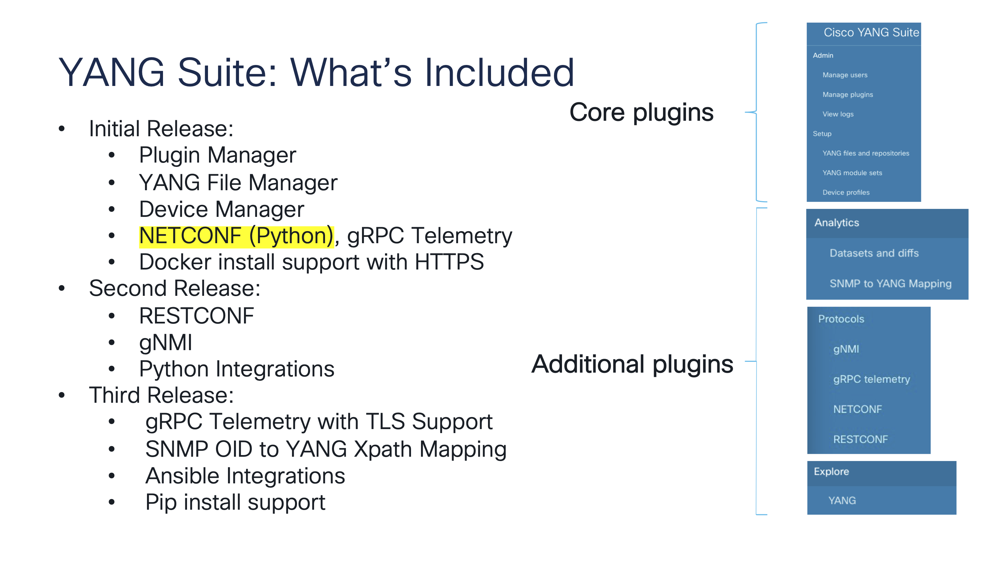
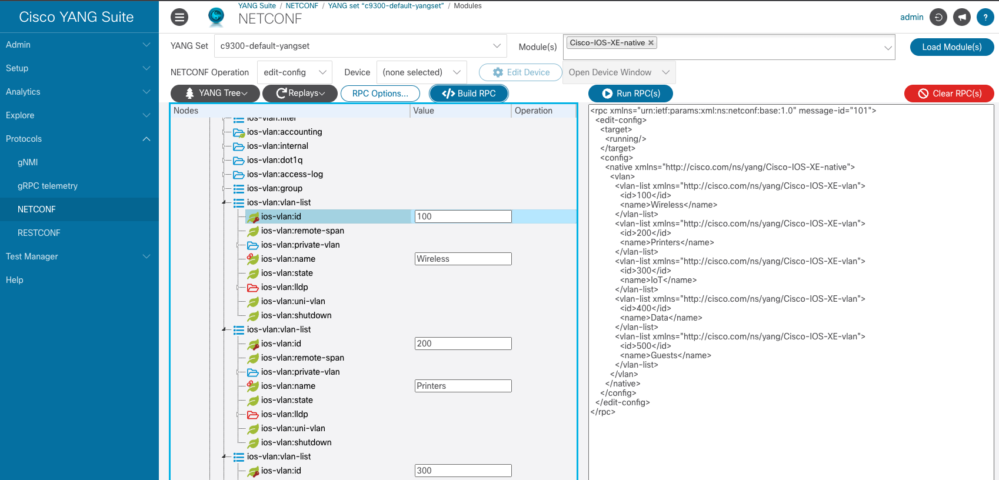
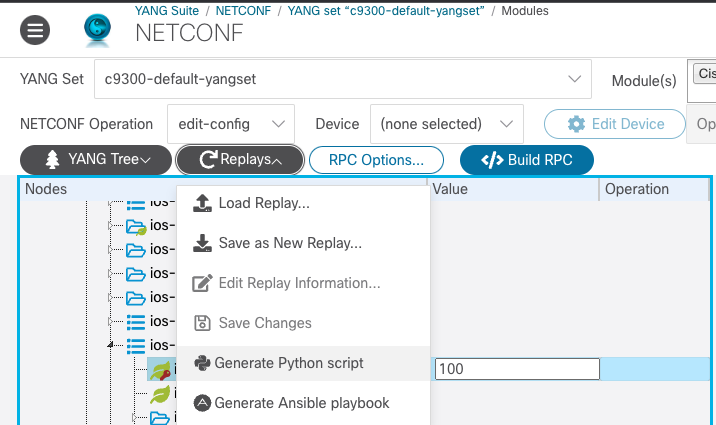
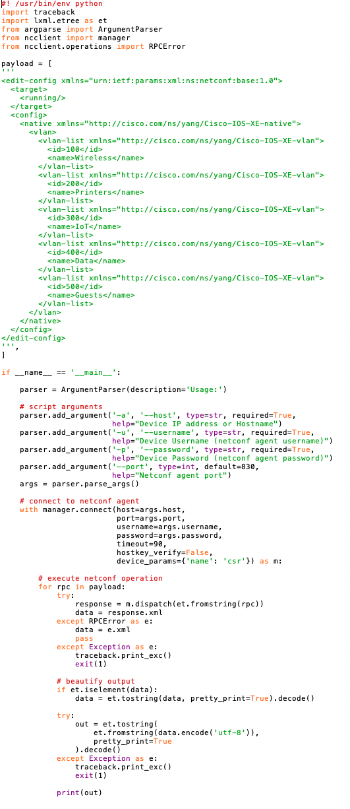
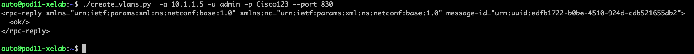
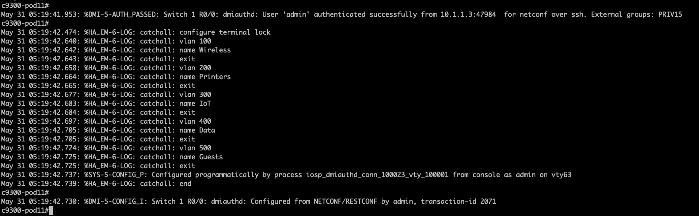

Base tasks **all NETCONF**

# Jeremy - TODO for YANG Suite component (first on the schedule!)

## 1. Introduction to IOS XE Programmability and YANG Suite 

### 1.1 YANG model payload and NETCONF for configuration change
Learning objective: Learn model-driven programmability without complexity - use a tool to navigate YANG models and build a JSON payload.

The API lifecycle for Cisco Catalyst and IOS XE is shown below and the focus of this lab is the Day 1 Model Driven Programmability "NETCONF/YANG" features. This NETCONF API will be used for the programmatic management and interactions with the Catalyst 9300 switch in the lab.



There are several legacy and programmable interfaces available to manage IOS XE with and they each have their own unique pro's and con's or advantages and disadvantages. NETCONF/YANG is based on RFC standards and has a long history of feature innovations. The YANG data models define what operations the API supports and also describes the features and how to configure them.

The **netconf-yang** API is already enabled on the lab switches. Check for this CLI in the **show run | include netconf** or run the **show netconf-yang** for operational details of the feature.


The YANG data models define what the API's support. There are many data models and they are sorted into a few different categories as described below. The **Cisco-IOS-XE-native.yang** has the majority of the **running-config** modelled within it and will be used to change the running configuration on the switch. There are some features which have **CFG** or configuration specific models, and of course for monitoring of operational data like from **show commands** there is a variety of **oper** models.

These YANG data models can be view and explored from the public Github repository  https://github.com/YangModels/yang/blob/main/vendor/cisco/xe/17111/Cisco-IOS-XE-native.yang However in this lab the YANG Suite tooling will be used to download and access the data models directly from the running C9300 in the lab and not from Github. 


YANG Suite is the testing and validation tool developed and used by Cisco for the past 5 years and since 2021 has been freely available for customers at https://developer.cisco.com/yangsuite/ and https://github.com/CiscoDevNet/yangsuite/ There is extensive support for all API operations on IOS XE within this very powerful tool that will be used within this lab.



YANG Suite has many capabilities and today the focus will be on the Day 1 NETCONF API and the Core "NETCONF" plugin to YANG Suite will be used to work with the **VLAN** feature



With the basics understood.... 

Lets' do a Device Reachability Check

Then

Login to the YANG Suite tool then navigate to the **Protocols >> NETCONF** page.

Select the following in YANG Suite

1. Protocol: “NETCONF”
2. YANG Set: “c9300-default-yangset”
3. Modules: “Cisco-IOS-XE-native” (note: start typing "native" to filter through the options in the dropdown menu)
4. Click the blue “Load Modules” button
5. NETCONF Operation: “get-config”
6. Device: “c9300”
7. Wait for the tree to appear in the grey box on the left
8. Once the YANG tree is created, select "YANG Tree" then "Search"
9. Search for "VLAN"
10. Select the Xpath "/native/vlan"
11. Click "Show selected node" button on bottom right
12. The VLAN Container is now seen which is near the top of the "native" container
13. In the "Value" column and the "vlan" row: click the mouse to set the tick box 
14. Click "Build RPC" and examine the XML RPC that has been build
15. Click "Run RPC" and examine the new tab/window that has the responce
 
Which data is returned from the API ? There may be none configured yet so there mnay be an empty responce. This "get-config" workflow will be used again once we configure the VLAN feature by adding some entries.

The "show vlan" CLI can also be used, along with the "show run | format netconf-xml" command to view the XML configuration of the running-config. Enable the terminal monitor with **term mon** in order to watch what happens when we manually run the edit-config in the next steps


1. Change the "NETCONF Operation" to "edit-config"
2. Expand the "ios-vlan:vlan-list" list
3. In the "ios-vlan:id" keyed leaf add the VLAN ID number 100
4. In the "ios-vlan:name" linked-leaf add the VLAN name "Wireless AP"
5. On the "ios-vlan:vlan-list" list: right-clight and select "Add another list entry" and another list entry will be added below where another VLAN ID/name can be managed
6. On the 2nd "ios-vlan:vlan-list" entry add the VLAN ID and Name for 200 and Printers
7. Repeat this process for Vlan300/IOT, 400/Data and 500/Guests
8. Click "Clear RPC" button
9. Click "Build RPC" button

The RPC should look similar to the below when created correctly:

```
<rpc xmlns="urn:ietf:params:xml:ns:netconf:base:1.0" message-id="101">
  <edit-config>
    <target>
      <running/>
    </target>
    <config>
      <native xmlns="http://cisco.com/ns/yang/Cisco-IOS-XE-native">
        <vlan>
          <vlan-list xmlns="http://cisco.com/ns/yang/Cisco-IOS-XE-vlan">
            <id>100</id>
            <name>Wireless</name>
          </vlan-list>
          <vlan-list xmlns="http://cisco.com/ns/yang/Cisco-IOS-XE-vlan">
            <id>200</id>
            <name>Printers</name>
          </vlan-list>
          <vlan-list xmlns="http://cisco.com/ns/yang/Cisco-IOS-XE-vlan">
            <id>300</id>
            <name>IoT</name>
          </vlan-list>
          <vlan-list xmlns="http://cisco.com/ns/yang/Cisco-IOS-XE-vlan">
            <id>400</id>
            <name>Data</name>
          </vlan-list>
          <vlan-list xmlns="http://cisco.com/ns/yang/Cisco-IOS-XE-vlan">
            <id>500</id>
            <name>Guests</name>
          </vlan-list>
        </vlan>
      </native>
    </config>
  </edit-config>
</rpc>
```

10. The screen should match the below example
11. Click "Run RPC" button to add the VLAN's



This is an example of managing the VLAN feature with YANG Suite. Instead of manually sending the RPC lets understand how to export this YANG payload to a usable python script that will be used throught the lab. From the **Replays** button select **Generate Python script** and a file will be downloaded from YANG Suite into your browser.



Examine the Python file that was downloaded. There is a large block of green XML that is the same XML payload that YANG Suite generated and sent earlier, along with some details on how to call and authenticate using this example python script.



This file has been saved into **/home/auto/create_vlans.py** and can be ran with options like below:

```
./create_vlans.py  -a 10.1.1.5 -u admin -p Cisco123 --port 830
```

Once ran the output will look similar and there will only be an "OK" message returned from the API




Examine the console log messages from the switch showing the begin and end of the NETCONF session as well as details of the VLAN's being created.



The log messages should be similar to the below output:
```
c9300-pod11#
May 31 05:19:41.953: %DMI-5-AUTH_PASSED: Switch 1 R0/0: dmiauthd: User 'admin' authenticated successfully from 10.1.1.3:47984  for netconf over ssh. External groups: PRIV15
c9300-pod11#
May 31 05:19:42.474: %HA_EM-6-LOG: catchall: configure terminal lock
May 31 05:19:42.640: %HA_EM-6-LOG: catchall: vlan 100
May 31 05:19:42.642: %HA_EM-6-LOG: catchall: name Wireless
May 31 05:19:42.643: %HA_EM-6-LOG: catchall: exit
May 31 05:19:42.658: %HA_EM-6-LOG: catchall: vlan 200
May 31 05:19:42.664: %HA_EM-6-LOG: catchall: name Printers
May 31 05:19:42.665: %HA_EM-6-LOG: catchall: exit
May 31 05:19:42.677: %HA_EM-6-LOG: catchall: vlan 300
May 31 05:19:42.683: %HA_EM-6-LOG: catchall: name IoT
May 31 05:19:42.684: %HA_EM-6-LOG: catchall: exit
May 31 05:19:42.697: %HA_EM-6-LOG: catchall: vlan 400
May 31 05:19:42.705: %HA_EM-6-LOG: catchall: name Data
May 31 05:19:42.705: %HA_EM-6-LOG: catchall: exit
May 31 05:19:42.724: %HA_EM-6-LOG: catchall: vlan 500
May 31 05:19:42.725: %HA_EM-6-LOG: catchall: name Guests
May 31 05:19:42.725: %HA_EM-6-LOG: catchall: exit
May 31 05:19:42.737: %SYS-5-CONFIG_P: Configured programmatically by process iosp_dmiauthd_conn_100023_vty_100001 from console as admin on vty63
May 31 05:19:42.739: %HA_EM-6-LOG: catchall: end
c9300-pod11#
May 31 05:19:42.730: %DMI-5-CONFIG_I: Switch 1 R0/0: dmiauthd: Configured from NETCONF/RESTCONF by admin, transaction-id 2071
```

TODO; VIEW: Cisco/Native/Interfaces

TODO: Where the save-config as cisco-ia YANG

TODO: Summarize the VLAN's being created.


- Overview of YANG Suite RESTCONF / Swagger - C9300 (10.1.1.5)
- Use YANG Suite RESTCONF to create VLANs on c9300 as follows:

| vlan_id | vlan_name   |
| ------- | ----------- |
| 100     | Wireless AP |
| 200     | Printers    |
| 300     | IoT         |
| 400     | Data        |
| 500     | Guests      |

**--> SEND THIS IN YANG SUITE!**

### 1.2. Create a Jinja2 Template to Configure Interfaces (NETCONF Payload)
Learning objective: Prepare the participant to handle incoming Webhooks. They will need to gather information such as interface description or state and use this to generate a payload without making a crazy Python variable with lots of f-strings.

- Review YANG model for interface. Participants should build a URL e.g. https://c9300/restconf/data/Cisco-IOS-XE-native:native/interface/GigabitEthernet=1/0/3 (may need URL encoding e.g. GigabitEthernet=1%2F0%2F2 if requests does not handle this?)
- YANG nodes to cover that will correlate to ticket system:
  - Interface description
  - Interface state (shutdown/no shutdown)
  - ```switchport mode access``` / ```switchport mode trunk```
  - Access VLAN / Trunk allowed VLANs
  - **Consider - but may be too much** - IPv4 address for interface. This might be tricky with NetBox as we would need to create arbitrary prefixes in IPAM. Possible but what do you think?

**--> DO NOT SEND THIS IN YANG SUITE, TAKE THE RPC AND USE IN PYTHON!**

### 1.3. Render Jinja2 Template in Python and use ```ncclient``` to configure an interface
Learning objective: The first steps in Network Automation usually involve building a script. This script will be part of the baseline and will be iterated until the final task, where we are fully event-driven.

- Show how to render template by passing variables to the template
- Run script

## Check-list before continuing

Before continuing to the next task, you should have completed the following:

- [x] **a**
- [x] **b**
- [x] **c**


